# 计网复习 2022

本复习提纲承接佳辛老师（[skyleaworlder](https://github.com/skyleaworlder)）的 [计算机网络复习提纲](https://github.com/skyleaworlder/NOT_NOTE/tree/main/Computer-Network/AST-DJW)  而来。我们感谢他。

## 考试题型

1. 填空题（每空 0.5 分，共 10 分）
2. 单项选择题（每题 2 分，共 40 分）
3. 大题（6 题，共 50 分）

## 大题复习指导

### 1. 数据帧中序号字段的长度设置

帧序号是用于防止 **接受方多次收到同一帧** 的办法。而这里指的 **帧序号长度设置**，是在 **数据链路层滑动窗口** 中出现的。

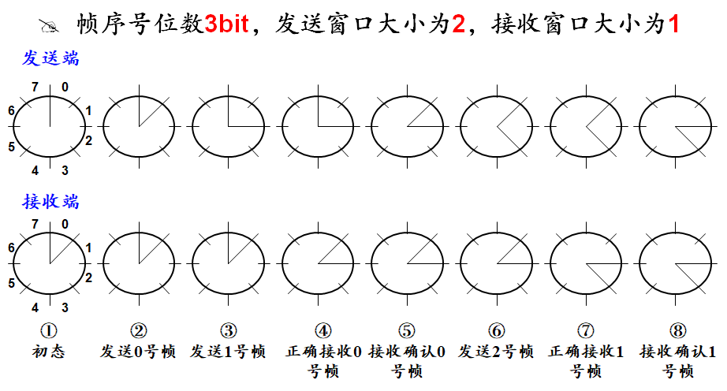

帧序号位数假设为 $n\operatorname{bits}$，那么滑动窗口 **可容许的大小** 就为 $2^n$。

滑动窗口的设置有如下规则：

- 发送流量 $\le$ 接收流量（但不意味着发送窗口 $\le$ 接收窗口）；
- 按理说发送端设置发送窗口、接收端设置接收窗口，但全双工通信需要双方都设置两个窗口；
- 发送窗口的大小可以改变，但是不能超过预设的 **最大尺寸**；这个 **最大尺寸** 又有窗口设置上的 **最大限制**（$2^n$）；
- 接收窗口大小始终固定，但这个固定好的 **尺寸** 一定不能超过窗口设置的 **最大限制**（$2^n$）。

#### i. 滑动窗口的精髓

相较于一般的停-等协议，滑动窗口旨在提高链路的 **利用率**。怎么提高呢？在停-等协议中，发送端发送出去一个帧后，需要等到该帧的确认帧返回后，才再发送下一帧。这之间，就有一个基于 **传输时延** 空闲时间。

如果传输时延设为 $\tau_t$，接收方处理帧的时间为 $\tau_p$，那么空闲时间 $RTT$ 就是 $2\tau_t + \tau_p$。

对于一条链路，它的 **最大传输带宽** 是有限制的。那么就可以根据 **带宽、RTT (Round-Trip Time) 和 数据帧大小** 来设计滑动窗口。

#### ii. 例题

```chinese
一条带宽为 1.6Mbps 的链路，往返时延为 45ms，数据帧大小为 1KB。
用滑动窗口尽可能提高利用率，求帧序号长度。

该链路发送一帧需要：1KB * 8 = 8Kb; 8Kb / 1.6Mbps = 5ms。
往返时延中可发：45ms / 5ms = 9 帧。总共可连续发送 1 + 9 = 10 帧
因此帧序号长度可为：ceil(log_2(10)) = 4bit
```

（注：这个时延自然是从 **完全发出去** 之后才开始算的，时延内可发 9 帧，加上最开始的就是 10 帧了）

同时，还可能从另外一个角度考虑——“管道” 中数据量。通常使用带宽时延积来作为评估 “管道” 中最大数据量的指标。可见第三章课件 93 页。

```chinese
一个 4Mbps 点到点链路，节点间距离 5000km，数据帧大小为 1KB。
信号传播速度为 3×10^8 m/s，设计选择性重传滑动窗口协议。求 “管道满载” 时，最小的序号长度。

RTT = 10^7 m / 3×10^8 m/s = (100/3)ms
带宽时延积为：(100/3)ms × 0.5MBps = (50/3)KB
总共可连续发：(50/3)KB / 1KB = 50/3 = 16
（向下取整是因为只能发整个包，和帧序号位数必须 “对数结果向上取整” 不一样）
帧序号长度最小为：ceil(log_2(16)) = 4
```

### 2. 交换技术：电路交换、报文交换和分组交换，计算总延迟

第二章课件 129 页开始。

#### i. 电路交换

需要建立起来一条 **专用物理连接线路**，传输结束后才释放。那么建立这个链路是需要时间的，而且时间还不短。

发送一条信息，从打算建立电路开始，需要花费（建立电路+发送数据（传输时延）+数据传输（传播时延））这样三部分延迟时间。

#### ii. 报文交换

不多说。估计不会怎么考，因为就是简单的 **存储-转发**。由于是一个一个报文发的，最小发送单元是报文，所以 **从报文角度来看** 没有类似流水线的操作。

#### iii. 分组交换

将一个报文划分成多个 **格式统一** 的分组，然后对分组进行 **存储-转发**。（分组大小应该是远小于完整报文的大小，所以可以仿照流水线加速）

假设每个分组的大小为 $x$ 比特，共有 $m$ 个分组，中间经过 $n$ 个路由器跳转，链路带宽平均为 $b\operatorname{bps}$，传播时延为 $d\operatorname{s}$，那么传播总时间为：$\dfrac{x}{b} \times (m+n) + d$。

### 3. 计算机网络的主要性能指标：带宽、时延、利用率

#### i. 带宽

现在的带宽指 **数字信道** 传送的最高数据率（等同于 **数据在通路上的发送速率**）。**带宽也叫吞吐量**。单位现在一般为 `bps`。

#### ii. 时延

指一个报文 / 分组从一个网络 / 链路的 **一端传输到另一端所需的时间**。

总时延 = 发送时延 + 传播时延 + 处理时延，其中需要注意的是：

- **信号传输速度 != 信号在信道上的传播速度**。传输是传输，和带宽有关；传播是传播，和物理介质与波的属性有关；
- 发送时延（又称传输时延）指 **从开帧的第一个比特开始发送算起，到最后一个比特从节点进入链路之间的时间**。发送时延 = 数据帧长度 / 带宽；
- 传播时延 = 信道长度 / 电磁波在信道上的传播速率；
- 处理时延一般会直接给出，因为它是 **存储-转发** 过程中 **必要花费的时间**。**排队时延是处理时延的重要组成部分**。

#### iii. 利用率

信道利用率指 **信道有百分之几的时间被利用**，而这个 “利用” 指的是 “发送端向链路中发送数据”：

$$
\alpha = \dfrac{\dfrac{l_1}{c_1}}{\dfrac{l_1}{c_1} + 2  R + \dfrac{l_2}{c_2}}
$$

其中：

- $l_1$ 为发送端在一个发送周期中所发送的比特数；
- $l_2$ 为接收端回应的确认帧长；（一般和 $l_1$ 相同）；
- $c_1$ 为发送端的数据传输率；
- $c_2$ 为接收方的数据传输率；（一般与 $c_1$ 相同）
- $R$ 为单向传播时延。

完全空闲的信道利用率为 0。而信道 **利用率一旦提高**，**信道引起的时延也就迅速增加**：

$$
D = \dfrac{D_0}{1-U}
$$

由此可见，**信道利用率并非越高越好**。一般计算的时候，可能会忽略某些时延。哪怕信道的利用率已经非常高了，也会忽略它们。

此处 $D_0$ 为空闲时的时延，$U$ 为信道利用率。

### 4. 数据链路层滑动窗口

数据链路层全双工数据传输使用滑动窗口进行流量控制和差错控制：选择重发 `ARQ` 协议和退后 `N` 帧 `ARQ` 协议。

考试的话，估计就是让画出故障之后的图。

```
假设 A 站和 B 站之间的全双工数据帧传输使用滑动窗口进行流量控制和差错控制，帧序号位数为 3，设 A 站有 10 个数据帧要发送，B 站有 4 个数据帧要发送，使用选择重传 ARQ 协议，帧的确认尽量使用捎带确认，若没有数据帧，可用 ACK 进行单独确认，用 NAK 进行单独否认。假定没有超时和帧丢失，发送窗口和接收窗口均从序号 0 开始。帧的格式为：（帧类型，发送序号，确认序号）。发送序号或确认序号如果没有意义，可用 N 表示；确认序号指出下一个希望接收的数据帧序号。请在后图所示的情况中填写带下划线的空白处（若没有帧，则帧类型为 NONE）。
     A 站                           B 站
( I    ,  0 ,  0 )  ------------>
( I    ,  1 , _0_)  ------------>
( I    ,  2 , _0_)  ------------>
                   <------------  (I, 0, _3_)
                   <------------  (I, 1, _3_)
( I    , _3_, _2_)  ------------>
( I    , _4_, _2_)  ------------>
( I    , _5_, _2_)  ------------>
( I    , _6_, _2_)  ------------>
(_NONE_, _N_, _N_)  ------------>
(_NONE_, _N_, _N_)  ------------>
                   <------------  (I, 2, _7_)
( I    , _7_, _3_)  ------------>
( I    , _0_, _3_)  ------------>
                   <------------  (I, 3, _1_)
( I    , _1_, _4_)  ------------>
                   <------------  (NAK, N, _1_)
( I    , _1_, _4_)  ------------>
                   <------------  (ACK, N, _2_)
```

#### i. 后退 N 帧的 ARQ 协议

协议掺在一起不好说，还是应该分开叙述。

发送方是后退 `N` 帧的主角。其用 `x` 个比特维护着一个滑动窗口，大小为 $2^x$；对窗口内每个单元都维护一个超时计时器；还存有期待的 **`ACK` 序号**：

- 当上一层传下数据后，检查窗口是否已满，如果未满则下界滑动窗口（唯一滑动下界的地方）；
- 当向下一层传数据时，备份发送的数据，并非直接销毁（以备重传）；
- 当收到下一层传来的 `ACK` 后，销毁 **编号对应的帧及其前所有未销毁的帧** 的备份，上界滑动窗口（唯一滑动上界的地方）；
- 当窗口内某个单元的计数器超时，立刻利用帧备份，重发所有 **已发送但未收到确认帧** 的帧。

接收方的戏份比较少，其同样有一个滑动窗口，但大小固定；同时接收方维护一个期待的 **帧序号**：

- 当下一层传上数据后，滑动窗口 **已满则丢弃**，若帧序号 **不符合期待也丢弃**，并且返回 **ACK-已接收的最大帧序号**。如果满足则下界滑动窗口（唯一滑动下界的地方）；
- 当帧处理结束后，发送对应的 `ACK`，上界滑动窗口（唯一滑动上界的地方）。

也就是说，接收方只接受顺序到达，此外所有情况均丢弃。

#### ii. 选择重发 ARQ 协议

总的来说，大致过程和 **后退 N 帧** 没有特别大的差异。选择重发也用计时器，也用滑动窗口。可它们还是有不同点的，比如 `NAK`，比如乱序接收，比如帧缓存。但二者最重要的不同点是：“**选择重发 ARQ 协议只需要重传那一个超时的帧，而后退 N 帧很可能重传很多帧**”。

我们考的这个选择重发协议应该和网上的有些不太一样。

选择重发 `ARQ` 协议在不考虑 `NAK` 的时候，允许非顺序的接收。并且 **接受了就返回一个** `ACK`，因此必须维持一个缓冲区。由于是乱序接收，对于数据链路层的上一层，每次并非上传一个数据，而是上传一整个窗口的数据。

比如，现在接收窗口覆盖的有 “0, 1, 2, 3”，现在接收到了 1 和 2，那么即使 0 到了，也不移动窗口 / 向上一层上传。需要等到 3 号到达，也就是 **整个窗口的所有帧序号都到达了**，**才会移动窗口**。

假设 3 在发送端定时器超时，也不会像之前 **后退 N 帧** 时一样发送很多帧，仅仅只会发送序号为 3 的帧。

##### 补：带 NAK 的选择重发 ARQ 协议

书上说了 **选择重传策略通常跟否定策略结合起来一起使用**。那很有可能考试考的就是结合起来使用。

详情可见书 188 页的下半页：

```chinese
当接收方有理由怀疑出现了错误时，它就给发送方返回一个否定确认（NAK）帧。
……
NAK 中指定了要重传的帧。
……
如果 NAK 被损坏了，或者丢失了，则不会有实质性的伤害。
因为发送方最终会超时，无论如何它都会重传丢失的帧。
```

在看课件的时候，我们经常会被眼花缭乱的时序图蒙蔽了双眼，脑子里面乱乱糟糟。实际上我只需要明白 “**NAK 是插件，而非主体功能**” 就好。

没了 `NAK`，照样可以选择重发；有了它，只不过是令其效率更高罢了。`NAK` 令协议少了些耐心——接收方凡是看到了不符合期望的，都会返回 `NAK`，尤其序号错乱时。（因为接收方很有理由怀疑 “序号错乱就是帧丢失导致的”）

### 5. 千兆以太网设计

交换机、路由器、服务器、主机、网卡、要求高可靠性（冗余设计），会画出拓扑结构图、计算各网络设备的数量，知道交换机内的 `Spanning Tree` 算法的作用，了解实现负载均衡的常用分组调度算法，例如 `FQ` 等。

可以看看计网最后一个实验的拓扑图。

### 6. 利用 `M/M/1` 排队模型分析服务器平均响应时间

会灵活应用公式：$T = \dfrac{1}{服务率-到达率}$。

以 FDM 为例，设信道容量为 C（bps），信道数据到达率为 $\lambda$ 帧/s，每帧的长度服从指数概率密度函数分布，其平均值为 $1/\mu$ bit/帧，则平均延时 T 由排队论（见补充资料）可知

$$
T=\dfrac{1}{\mu C-\lambda}
$$

若信道分成 $N$ 份，则：

$$
T_{FDM}=\dfrac{1}{\mu(C/N)-\lambda/N}=\dfrac{N}{\mu C-\lambda}=NT
$$

结论：平均时延较长，不能有效地处理通信的突发性。

#### 资源预留

问题：路由器如何将一个流规范转变成一组特定的资源而进行预留？

解决：以一个分组在经过路由器的平均延迟 $T$（排队时延 + 处理时延）为例

- 分组随机到达，平均到达率为每秒 $\lambda$ 个分组（由流规范确定）；

- 分组具有随机长度，且以平均速率每秒 $\mu$ 个分组发送到链路上（由预留的资源确定）；

- 分组的到达和服务均服从泊松分布（M/M/1 排队系统），利用排队论可得：（$\rho$ 是 CPU 的利用率）
  $$
  T=\dfrac{1}{\mu-\lambda}=\dfrac{1}{\mu}\times\dfrac{1}{1-\lambda/\mu}=\dfrac{1}{\mu}\times\dfrac{1}{1-\rho}
  $$

### 7. 广播路由算法（重点掌握后面两个，计算广播生成的分组数）

这个 **分组** 是什么东西呢？就是网络里面的数据包。一个路由器接收到分组后，转发分组，需要注意的是用于转发的新分组并非之前接收到的分组。

#### i. 源端对目的端逐一发送

准备好所有的目标地址，目标地址有多少个就在 **最开始** 发多少个分组。

分组们在遇到路由器时，根据路由表走不同的转发路线。

- 原理：让源计算机简单地给每一个目的计算机单独发送一个分组；
- 优点：简单；
- 缺点：需知道每个目的地址，且浪费带宽（24 个分组）。

#### ii. 多目标路由

目标地址列表写到了分组中，分组中有完整的路线。于是每条链路上只有一个分组。

- 原理：每个分组含有一张目的地址的清单，路由器根据目的地址清单确定输出线路集合，并为每条输出线路复制一个新分组；
- 缺点：需要知道每个目的地址（13 个分组）。

#### iii. 泛洪法

> 计算起来比较恶心人。我的建议是只看节点。——佳辛

对于一个给定的路由器，假设它可能接收 $n$ 个方向的数据包，仔细想想它到底在过程中可能会接收哪几个方向的报文：

- 如果只接受一个方向的，那么它就会在网络中新产生 $n-1$ 个分组；
- 如果接收多个方向的，那么它就会在网络中新产生 $n$ 个分组（在这个算法中，路由器不会向 **同一条链路** 发 **多个相同** 的分组）。

最后加起来就行了。

- 原理：每个路由器都将收到的分组向除分组到达的线路外所有输出线路进行传送；
- 缺点：分组太多，浪费带宽（24 个分组）。

#### iv. 逆向路径转发※

做题的时候，题目要么给路由表，要么给 **Sink Tree (汇集树)**。

泛洪还是该泛洪，但是对于某些泛洪分组，路由器是不进行响应的。也就是说，不响应非常用链路上的分组 **会大大减少常用链路上的分组个数**（也就是在常用链路上的废物分组）。

需要注意的是，要人为判定 **哪些链路是常用于转发分组的**。

- 原理：若分组来自通常用于发送分组到广播源的线路上（或最短路径），则广播分组，否则丢弃分组；
- 特点：不必知道生成树，而且既合理有效又容易实现（所需发送的分组数较少：19） 。

#### v. 生成树广播路由※

离散讲过生成树。在一个网络中，生成树随着选取的 **根节点** 的不同而不同。

源计算机发送一个分组，那么中间的路由器都会通过源地址知晓 **该选择哪一个生成树**。

使用生成树广播路由时，网络中的分组数是最少的。

- 原理：沿生成树广播；
- 特点：每台路由器必须知道其生成树，但最佳使用带宽（所需发送的分组数最少：13）。

### 8. 隧道技术：掌握原理，会具体应用

- 隧道可用于 **连接两个不同的网络**。

- 隧道的建立，至少需要两个实现了双 / 多协议栈的路由器，由这个双 / 多协议栈路由器将原报文作为 `payload` 装在新协议中，并在新的网络中传输。

隧道技术是一种通过互联网络基础设施在网络之间传递数据的方式。

使用隧道传递的数据可以是不同协议的数据帧或包，隧道协议将这些其它协议的数据帧或包重新封装在新的包头中发送，被封装的数据包在隧道的两个端点之间通过公共互联网络进行路由，一旦到达网络终点，数据将被解包并转发到最终目的地。整个传递过程中，被封装的数据包在公共互联网络上传递时所经过的逻辑路径称为隧道。

简言之，隧道技术是指包括数据封装，传输和解包在内的全过程。

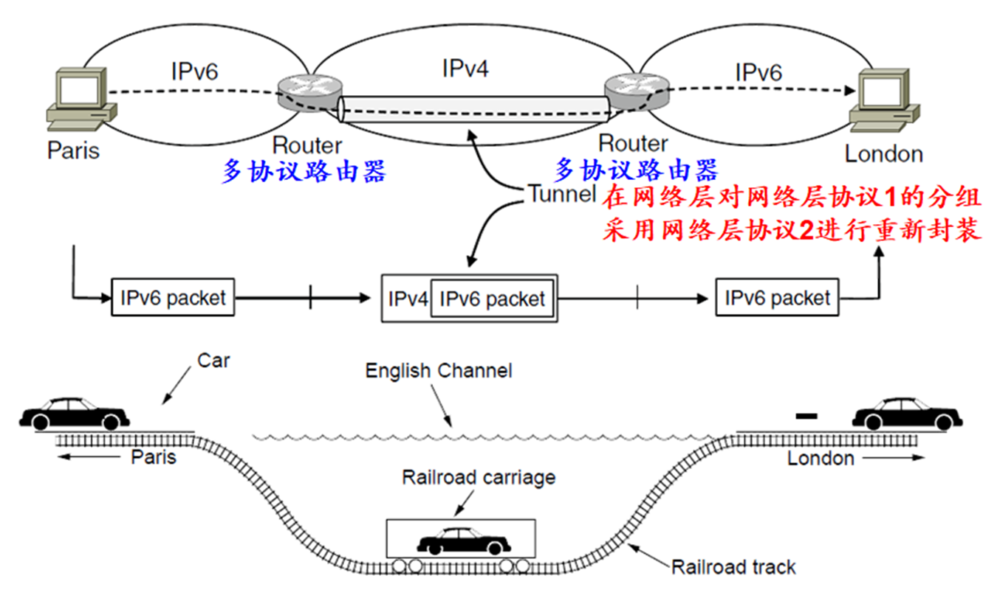

### 9. 流量整形技术：漏桶、令牌桶、令牌桶+漏桶

明确各技术的用途、算法、会计算各部分时间：突发、平稳、空闲。

漏桶和令牌桶是两个设计思路。

漏桶重在一个 “漏” 字，“漏” 就代表了处理的速率，桶里的 “水” 就是分组。这个漏口的大小一般来说是相对固定的，那么漏桶就使得流量的 **输出十分平缓**。**分组可被丢弃**（从上面漏）也是漏桶相对于令牌桶的特点。

令牌桶重要的 “令牌”。这个桶不漏底，桶接的不是水，而是源源不断产生的令牌。一个报文只有获取了对应的令牌，才能够被处理。而令牌是有一定数目的，这就使得令牌桶能够 **容忍突发流量**，也就是 **随时间 “累积” 发送能力**。

```chinese
1. 计算标称值：
计算机以 25MB/s 速率产生数据，路由器最大工作速率为 2MB/s。
数据以每秒有 40ms 的突发数据输入。为平稳输出。

每秒突发产生的数据量为：25MB/s × 40ms = 1MB
令桶空的最小速率为：1MB / 1s = 1MB/s
桶大小至少为 1MB，漏桶速率可在 1MB/s~2MB/s 范围内。
```

```chinese
2. 计算全速传输时间：
令牌桶整形，填充速率为 1Mbps。初始令牌桶填满，为 8MB。
求计算机能以 6Mbps 全速传输多久。

1t + 64Mb = 6t
t = 64 / 5 = 12.8s
```

```chinese
3. 计算持续最大数据率：
令牌桶整形，每 5 μs 一个令牌，一个令牌放行一个 48B 的数据。
求最大可持续数据率。

每秒产生令牌数：1s / 0.000005s = 0.2M/s
最大可持续数据率：48B × 0.2M/s = 76.8Mbps
```

漏桶主要为 **平稳输出**，令牌桶为 **允许突发流量**（也会导致平稳输出）。漏桶还可以和令牌桶一起使用，达到 **平稳输出、允许突发流量、减小速率峰值** 的效果。

这个漏桶怎么接呢？实际上就是 **令牌桶仍以最大速率运行，但将令牌桶处理的数据放入漏桶中**。这样即允许突发，又不至于突发的时候立刻满载。

```chinese
计算机以 25MB/s 速率产生数据，每秒有 40ms 突发数据输入。
为平稳输出、允许突发流量和减少速率峰值。
令牌到达率为 2MB/s，桶容量为 500KB，漏桶速率 10MB/s。
求每秒令牌桶+漏桶工作时间。

首先令牌桶满令牌满速率工作，对于漏桶而言，漏桶中增加的速率为：25MB/s - 10MB/s = 15MB/s
这段时间长度为：500KB + 2MB/s × t = 25MB/s × t，t = 21.73ms
此后令牌桶发射速度为 2MB/s，但漏桶还会以 10MB/s 消耗数据，总共是按 8MB/s 消耗。
这段时间的长度为：21.73ms × 15MB/s = t × 8MB/s，t = 40.74ms
总共加起来是 21.73ms + 40.74ms = 62.47ms

后面就不需要更多说明了。
```

### 10. 分组调度算法：重点掌握 `WFQ`，计算分组输出次序

在同一个流的分组之间以及在竞争流之间分配路由器资源。

#### WFQ

- 路由器上每条输出线路有多个队列，每个流一个队列；

- 一字节/多字节（取决于流的权重 $W$）地扫描各队列（一轮），反复进行直至每个分组结尾，分组以它们结束时间（轮数，计算公式如下）的先后进行排序，并以此顺序进行发送。
  $$
  F_i=\max(A_i,F_{i-1})+L_i/W
  $$
  ($A_i$ 为到达时间，$F_i$ 为完成时间，$L_i$ 为分组 $i$ 的长度)

这个调度算法和正常人的大脑电波不在一个频道上。无论是 **FQ** 还是 **WFQ**，都是要 **按字节扫描** 各队列。也就是说：

**处理时间** 不仅仅和分组的到达时间有关系，更与 **分组的长度** 有关系。（如果是 **WFQ** 的话，还会与 **队列权重** 有关系，权重用于 **加快** 扫描速度）


```
假设 A, B, C 三个队列的权重分别是 1, 1, 2，有如下分组信息：

分组 到达时间 长度
 A      0      8
 B      5      6
 C      5      10
 D      8      9
 E      8      8
 F      10     6
 G      11     10
 H      20     8

对于 A 分组，其应处理时间应该是 0+8 = 8。
但是仅仅计算出应处理时间，并不能确定 A 的次序，还需要算出其他的时间：

分组  扫描完成时间
 A     0+8 = 8
 B     5+6 = 11
 C     5+10/2 = 10
 D     8+9 = 17
 E     8+8/2 = 12
 F     10+6 = 16
 G     11+10/2 = 16
 H     20+8 = 28

所以排序是：A C B E F G D H
```

有时候可能用 “具体编程实现” 的说法更好理解：可把对每个队列的维护都看作一个进程，队列 **每进入一个新的报文**，都会 **开启一个新线程** 进行扫描。一旦扫描结束，就把这个报文 `enqueue` 到一个 “多个队列间共享” 的总队列（虚拟的，不存在，只供理解）中。

### 11. `Internet` 一次通信中 IP 地址、物理地址、端口地址的使用

如常用端口（80）的使用。在哪层使用？每层的数据单位叫什么？在经过的网络中如何变化（**IP** 地址和端口地址保持不变，但物理地址每经过一个网络都需改变，物理地址由 `ARP` 协议获得）

#### i. 端口的使用

端口是传输层中使用的，其存在于传输层协议中。

#### ii. 每层的数据单位

物理层中叫 “比特流”；数据链路层中叫 “帧”；网络层中叫 “包”；传输层中叫 “段(TCP) / 数据报(UDP)”。

#### iii. `Internet` 网络层通信过程

见第五章课件 134 页和 135 页：

##### 不可靠的、无连接的数据报服务

- 发送端：从传输层获取数据，封装成 IP 数据报，发送到 Internet 中；
- IP 路由器：对收到的 IP 数据报根据其中的目的地址查路由表转发出去；沿着一条路径将 IP 数据报从一个路由器转发到下一个路由器，直到 IP 数据报到达目的地；其中可能涉及到 IP 数据报的分段；（尽最大努力进行传输）
- 接收端：从收到的 IP 数据报中提取出数据提交给传输层，其中可能涉及到 IP 数据报的重组。

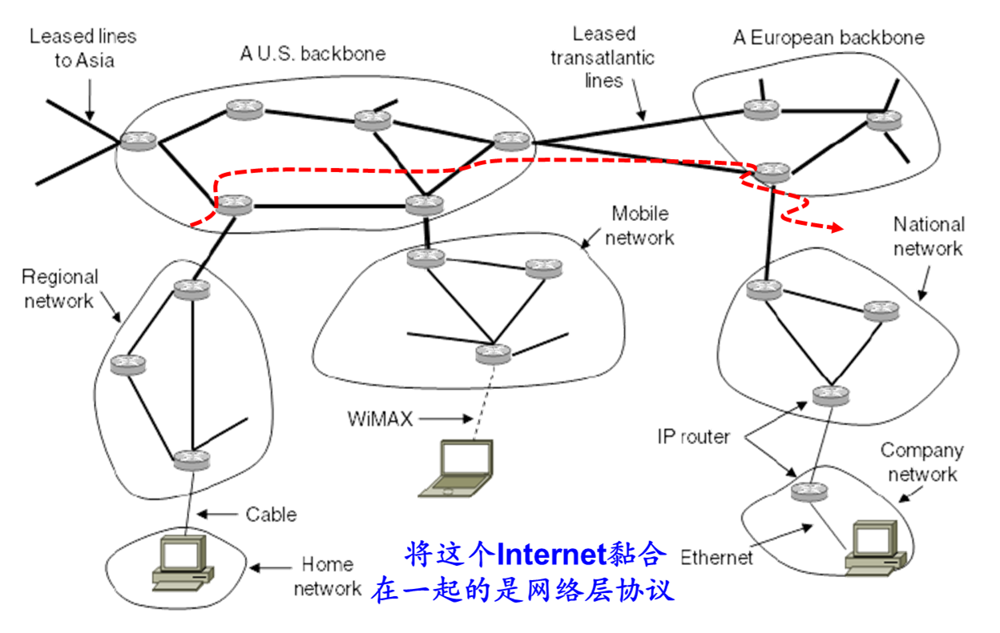

网络层协议是不同网络之间的粘合剂。

- 从传输层获取数据，封装成 `IP` 数据包，发送到 `Internet` 中；
- 中间的路由器根据 **IP 协议中的目标地址** 查找路由表，并转发，直到目的地；
- 从收到的 **IP 协议** 中获取数据，转交给传输层。

#### iv. 物理地址 / IP 地址 / 端口地址的使用

见第五章课件 140 页到 142 页。最关键的想必是 144 页的总结。

##### 物理地址

物理地址是单个网络内部对一个计算机进行寻址时所使用的地址，由计算机所属的网络进行定义，包含在数据链路层使用的帧中，是最低一级的地址。例如：以太网中的物理地址固化在网卡上的 ROM 中，占 6 字节（48 位），通常表示形式类似于 `07-01-02-01-2C-4B`。

##### IP 地址

IP 地址就是给每个连接在 Internet 上的主机（或路由器）分配一个在全世界范围是惟一的 32bit 的标识符（IPv4）。

##### 端口地址

端口地址用于唯一标识 Internet 主机中的每一个进程，在 TCP/IP 中端口地址为 16bit 长。

##### 总结

物理地址具有全球唯一性，就是 `MAC` 地址、网卡地址，是网络中对一个计算机寻址时使用的地址。在通信中通过 `ARP` 协议获得。

而 `IP` 地址的用法很模糊，我也一时说不清楚，只能说是用于锁定一台主机。

端口地址适用于标识 **一台主机中进程** 使用的地址。

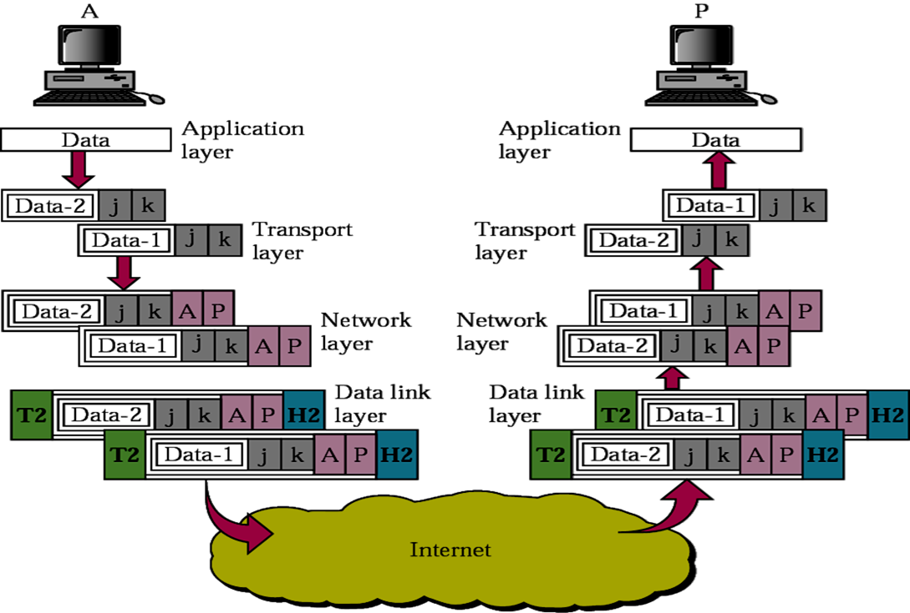

#### ARP 协议：用途、工作过程，分组中的地址如何使用

`ARP (Address Resolution Protocol)` 是 **以太网** 使用的地址解析方式，用途：**将 IP 地址映射到其对应的物理地址**。

主机和路由器中都有一个 `ARP` 表，表中是 **IP 地址到物理地址的映射**。如果需要地址解析，那么就执行以下步骤：

- 查找当前机器中的 `ARP` 表，如果有就返回，如果没有：
- 在本网络中广播 **ARP 请求分组**，收到广播的主机检查自己的 `ARP` 表，如果有就 **单播 ARP 响应分组**。

无论是 **ARP 请求分组**，还是 **ARP 响应分组**，都有发送主机自己的 **IP 地址和物理地址**，接收到分组的主机，都会缓存下这个组合到自己的 `ARP` 表中。

如第五章课件 247 页所言，如果 **目标主机和源主机不在一个局域网中**，那么就需要通过 `ARP` 询问本局域网内的某个路由器，让路由器转发 **IP 包** 到另一个网络中去。

### 12. 特殊 IP 地址的使用 ★

特别是两个广播地址的使用。

在 IPv4 协议中，每个 IP 地址由两部分组成：网络号（Netid）和主机号（Hostid）。网络号用于标识一个网络，主机号用于标识在该网络中的一个主机。

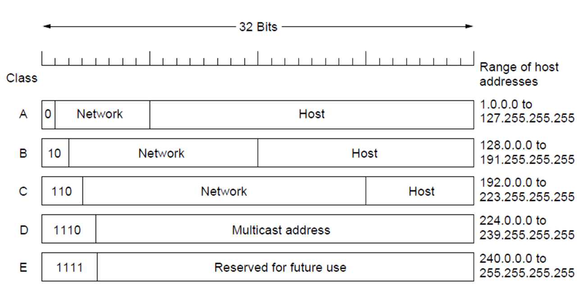

|      特殊地址      | Netid | Hostid | 用作源地址 | 用作目的地址 |
| :----------------: | :---: | :----: | :--------: | :----------: |
|      网络地址      | 特定  |  全 0  |    不可    |     不可     |
|    直接广播地址    | 特定  |  全 1  |    不可    |     可以     |
|    受限广播地址    | 全 1  |  全 1  |    不可    |     可以     |
|  本网络上的本主机  | 全 0  |  全 0  |    可以    |     不可     |
| 本网络上的特定主机 | 全 0  |  特定  |    可以    |     可以     |
|      环回地址      |  127  |  任意  |    可以    |     可以     |

#### i. 网络地址

网络地址用于定义网络本身。

#### ii. 直接广播地址※

直接广播地址对特定网络上的所有主机进行广播。

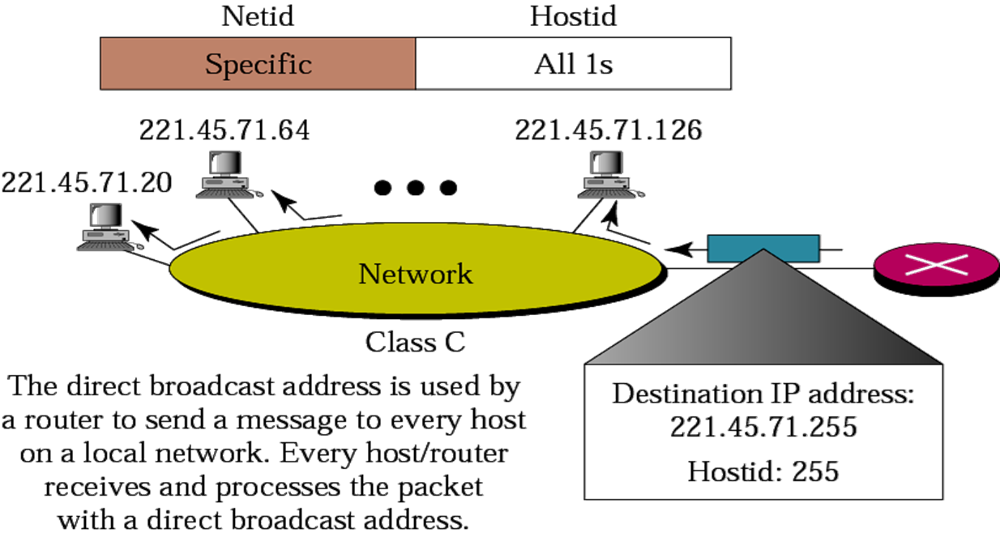

#### iii. 受限广播地址※

受限广播地址只在本网络上进行广播（各路由器均不转发）。

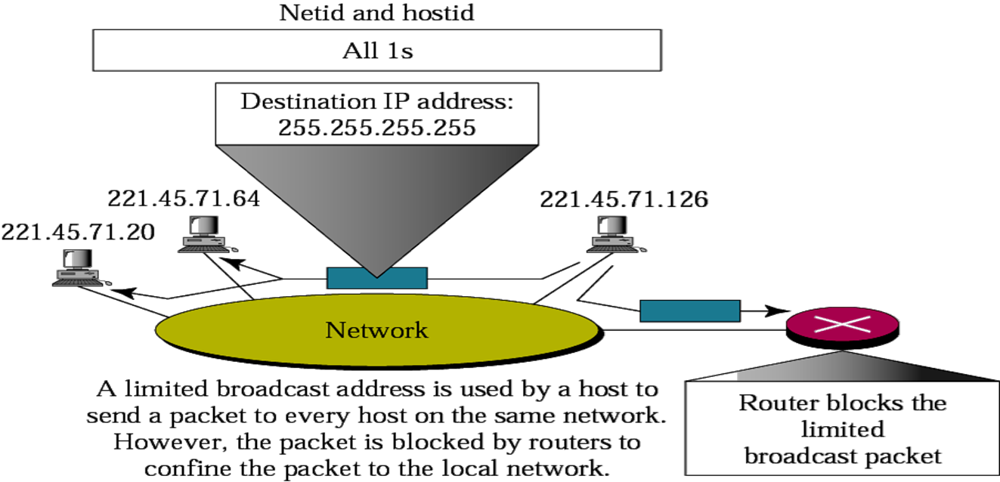

#### iv. 本网络上的本主机

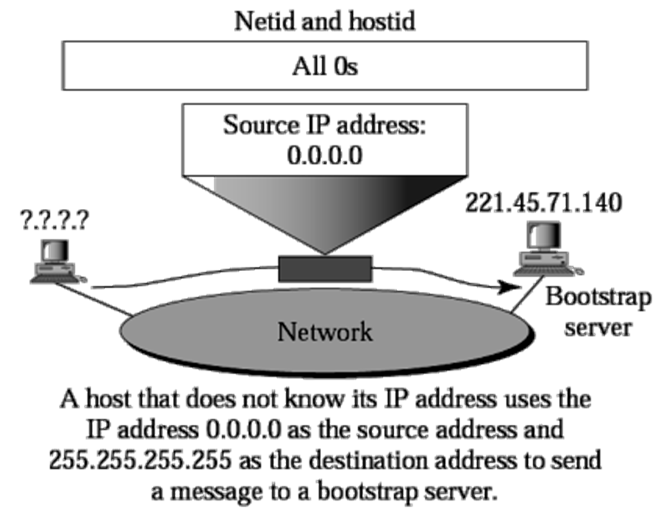

#### v. 本网络上的特定主机

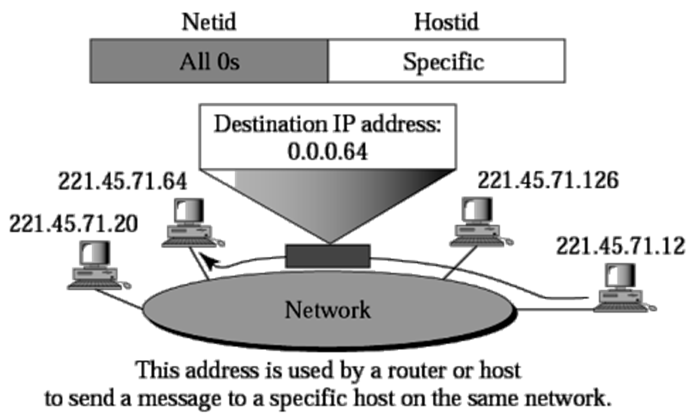

#### vi. 环回地址

环回地址用于本地软件回送测试之用。

### 13. IP 数据报的分片和重组 ★

> 特别注意片偏移字段的单位是 8B，故分片 IP 数据报的数据部分必须是 8 的倍数。

分段是将一个大的 IP 数据报分割成若干较小的 IP 数据报，一般在路由器上进行；重组是将若干较小的 IP 数据报重新组合成一个大的 IP 数据报，一般在目的主机上进行。

标识、标志和段偏移字段用于 IP 数据报的分段和重组。标识字段可以确定哪些分段属于同一原始 IP 数据报，段偏移字段确定分段在原始 IP 数据报中的位置，MF 标志位确定最后一个分段。

```
一个 3800B 长的 UDP 报文传到 IP 层，加上 20B 的首部后成为 IP 数据报，下面的互连网由两个局域网通过路由器连接起来，但第二个局域网所能传送的最长数据帧中的数据部分（MTU）只有 1420B，因此 IP 数据报在路由器必须进行分段。试问分成几段？每个分段的大小为多少？每个分段的固定首部中相关字段如何变化？
```

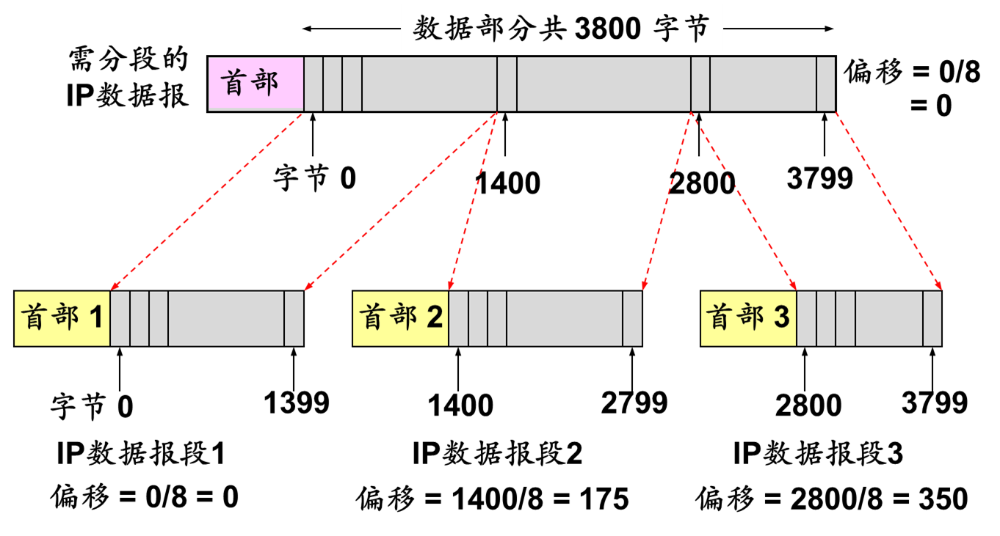

|                | 总长度 | 标识  | MF  | DF  | 段偏移 |
| :------------: | :----: | :---: | :-: | :-: | :----: |
| 原始 IP 数据报 |  3820  | 12345 |  0  |  0  |   0    |
| IP 数据报段 1  |  1420  | 12345 |  1  |  0  |   0    |
| IP 数据报段 2  |  1420  | 12345 |  1  |  0  |  175   |
| IP 数据报段 3  |  1020  | 12345 |  0  |  0  |  350   |

- **DF**: Don’t Fragment
- **MF**: More Fragments

### 14. NAT 的工作原理和工作过程 ★

网络地址转换（NAT）基本思想：ISP 为每个家庭或每个公司至少分配一个有效的外部全球 IP 地址 IP~G~（最多分配少量的），用这个 IP~G~ 来传输 Internet 流量；

- 在连接到 Internet 的路由器上安装 NAT 软件（NAT 路由器），在连接到 Internet 端设置 IP~G~；
- 通信时主机如需与 Internet 通信，则必须将主机的私有 IP 地址在 NAT 路由器转换成 IP~G~ 才可。

NAT 作为处理 IP 地址短缺的权宜之计技术，已经得到广泛应用，特别是家庭和小型企业。它已广泛集成到路由器、防火墙等网络设备中。


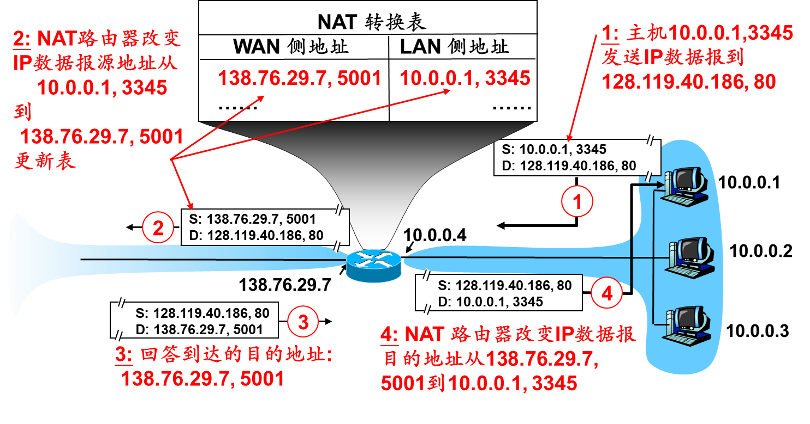

注意：普通路由器在转发 IP 数据报时，不改变其源 IP 地址和目的 IP 地址；**而 NAT 路由器在转发 IP 数据报时，一定要更换其 IP 地址**（转换源 IP 地址或目的 IP 地址）。**普通路由器仅工作在网络层，而 NAT 路由器转发数据报时需要查看和转换传输层的端口号。**

#### 例题

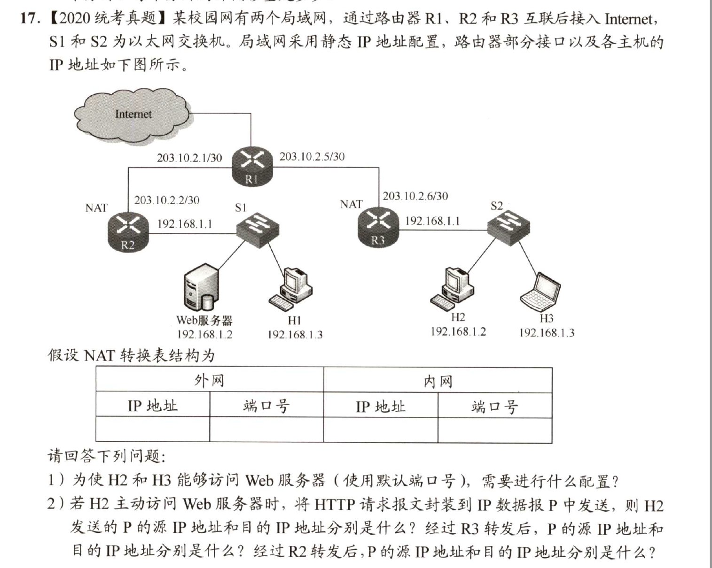

1. Web 服务器、H1 和 H2、H3 这两个子网使用了相同网段（`192.168.1.*`），且路由器开启了 NAT 功能，加上题干给出了 NAT 表的结构，因此需要配置 NAT 表。路由器 R2 开启 NAT 服务，当路由器 R2 从 WAN 口收到来自 H2 或 H3 发来的数据时，根据 NAT 表发送给 Web 服务器的对应端口。外网 IP 地址应该为路由器的外端 IP 地址，内网 IP 地址应该为 Web 服务器的地址，Web 服务器默认端口为 80，因此内网端口号固定为 80，当其他网络的主机访问 Web 服务器时，默认访问的端口应该也是 80，但是访问的目的 IP 是路由器的 IP 地址，因此 NAT 表中的外部端口最好也统一为 80。题中并未要求对 H1 进行访问，因此 H1 的 NAT 表项可以不写。**R2 的 NAT 表**配置如下：
   | 外网 IP 地址 | 端口号 | 内网 IP 地址 | 端口号 |
   | :----------: | :----: | :----------: | :----: |
   | 203.10.2.2 | 80 | 192.168.1.2 | 80 |
2. 由于启用了 NAT 服务，H2 发送的 P 的源 IP 地址应该是 H2 的内网地址，目的地址应该是 R2 的外网 IP 地址，源 P 地址是 192.168.1.2，目的 IP 地址是 203.10.2.2。
   R3 转发后，将 Р 的源 IP 地址改为 R3 的外网 IP 地址，目的 IP 地址仍然不变，源 IP 地址是 203.10.2.6，目的 IP 地址是 203.10.2.2。
   R2 转发后，将 P 的目的 IP 地址改为 Web 服务器的内网地址，源地址仍然不变，源 IP 地址是 203.10.2.6，目的 IP 地址是 192.168.1.2。

### 15. 路由器和交换机的区别

交换机用于 LAN 中的主机的连接，每个端口无需 IP 地址；路由器用于网络间的连接，每个端口都需要 IP 地址，且每个 IP 地址的网络号/网络前缀各不相同。

- 路由器：寻址，转发（依靠 IP 地址），交换机：过滤，转发（依靠 MAC 地址）。
- 交换机用于连接局域网，数据包在局域网内网的数据转发，路由器用于连接局域网和外网，数据包可以在不同局域网转发。
- 交换机工作于 TCP/IP 协议的最后一层数据链路层（物理层），路由器工作于网络层。
- 交换机负责具体的数据包传输，路由器不负责包的实际传输，路由器只封装好要传输的数据包，然后交给交换机去传输（不一定是交换机，可能是其他传输技术），用 java 比喻大概简单理解为路由器是抽象类，定义好传输的数据包格式，交换机是具体实现类，也可以有其他实现类。
- 交换机没有 MAC 地址和 IP 地址，路由器有 MAC 地址和 IP 地址（指纯粹的交换机和路由器，三层交换机是可以有 IP 地址的，路由器也有内置交换机功能的）。

### 16. 路由器、路由表和路由选择

#### 路由器

- 路由选择部分： 也叫控制部分，核心是路由选择处理机，其任务是根据所选定的路由算法构造出路由表，同时经常或定期地和相邻路由器交换路由信息而不断地更新和维护路由表。
- 数据转发部分：根据转发表将分组从合适的端口转发出去，有三部分组成：交换结构、一组输入端口和一组输出端口。

注意：路由表是根据路由算法得出的，而转发表是从路由表得出的。在讨论路由选择的原理时，往往不去区分转发表和路由表的区别。

#### 路由表

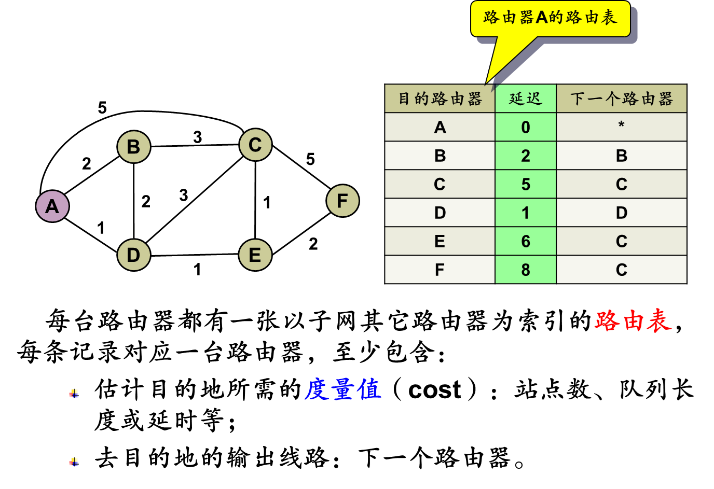

#### 路由选择

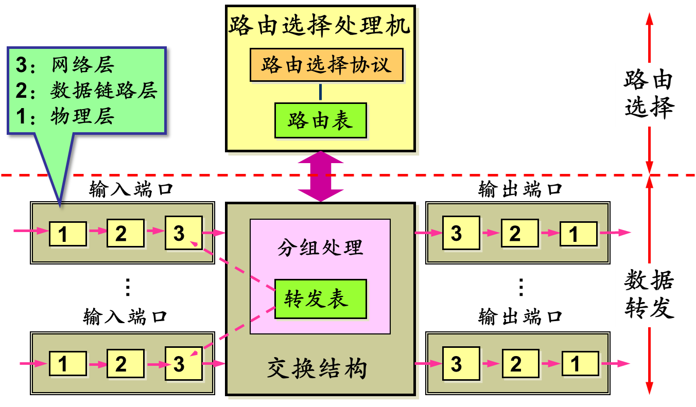

### 17. RIP 协议、OSPF 协议和 BGP 协议所使用的路由算法、适用范围、封装在哪个协议的分组中进行传输

#### 路由算法

##### 对路由算法的要求

- **正确性**：算法必须是正确和完整的；
- **简单性**：算法在计算上应简单，不应给网络带来过多的负担；
- **健壮性**：算法应能适应通信量和网络拓扑结构的变化；
- **稳定性（收敛性）**：在网络通信量和拓扑结构相对稳定的情况下，路由算法应收敛于一个可以接受的值，而不应产生过多的振荡；
- **公平性**：算法应对所有用户（除对少数优先级高的用户）都是平等的；
- **最佳性**：是指以最低的代价来实现路由算法。

#### 非自适应算法

- **静态路由**：不用测量也无须利用网络状态，按某种固定规则进行路由决策。
- 优点：简单和开销较小；
- 缺点：不能及时适应网络状态的变化。

#### 自适应算法

- **动态路由**：依靠网络的当前状态信息来动态决定路由决策。
- 优点：能较好地适应网络状态的变化；
- 缺点：实现起来较为复杂，开销也比较大。

常用的动态路由算法可分为两类：距离-向量路由算法和链路状态路由算法。

##### 距离-向量路由算法

在距离-向量路由算法中，所有结点都定期地将它们的整个路由选择表传送给所有与之直接相邻的结点。这种路由选择表包含：

- 每条路径的目的地（另一结点）。

- 路径的代价（也称距离）。

注意：这里的距离是一个抽象的概念，如 RIP 就将距离定义为 “跳数”。跳数指从源端口到达目的端口所经过的路由器个数，每经过一个路由器，跳数加 1。

在这种算法中，所有结点都必须参与距离向量交换，以保证路由的有效性和一致性，也就是说，所有的结点都监听从其他结点传来的路由选择更新信息，并在下列情况下更新它们的路由选择表：

1. 被通告一条新的路由，该路由在本结点的路由表中不存在，此时本地系统加入这条新的路由。
2. 发来的路由信息中有一条到达某个目的地的路由，该路由与当前使用的路由相比，有较短的距离（较小的代价）。此种情况下，就用经过发送路由信息的结点的新路由替换路由表中到达那个目的地的现有路由。

距离-向量路由算法的实质是，迭代计算一条路由中的站段数或延迟时间，从而得到到达一个目标的最短（最小代价）通路。它要求每个结点在每次更新时都将它的全部路由表发送给所有相邻的结点。显然，更新报文的大小与通信子网的结点个数成正比，大的通信子网将导致很大的更新报文。由于更新报文发给直接邻接的结点，所以所有结点都将参加路由选择信息交换。基于这些原因，在通信子网上传送的路由选择信息的数量很容易变得非常大。

最常见的距离-向量路由算法是 RIP 算法，它采用 “跳数” 作为距离的度量。


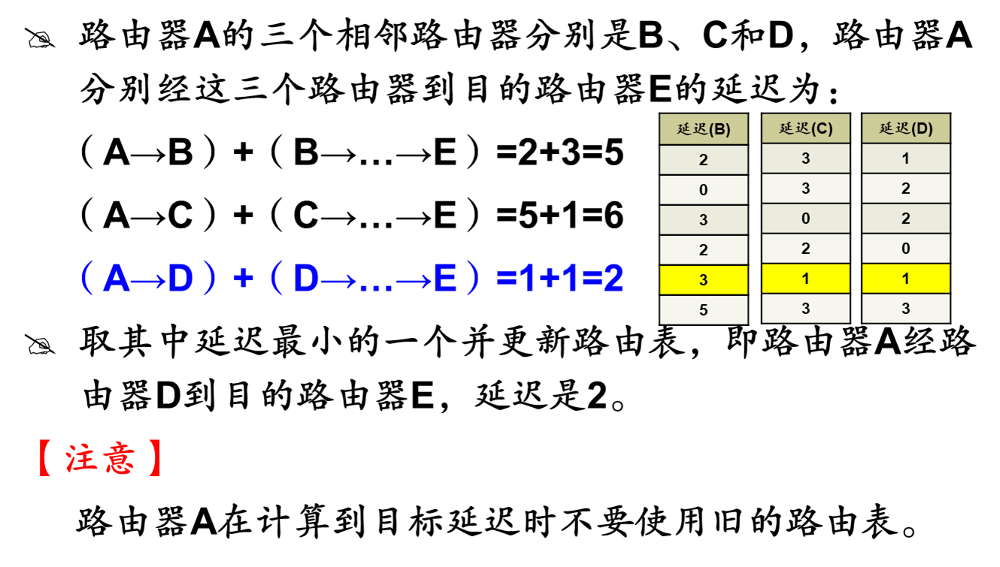

##### 链路状态路由算法

链路状态路由算法要求每个参与该算法的结点都具有完全的网络拓扑信息，它们执行下述两项任务。第一，主动测试所有邻接结点的状态。两个共享一条链接的结点是相邻结点，它们连接到同一条链路，或者连接到同一广播型物理网络。第二，定期地将链路状态传播给所有其他结点（或称路由结点）。典型的链路状态算法是 OSPF 算法。

在一个链路状态路由选择中，一个结点检查所有直接链路的状态，并将所得的状态信息发送给网上的所有其他结点，而不是仅送给那些直接相连的结点。每个结点都用这种方式从网上所有其他的结点接收包含直接链路状态的路由选择信息。

每当链路状态报文到达时，路由结点便使用这些状态信息去更新自己的网络拓扑和状态“视野图"，一旦链路状态发生变化,结点就对更新的网络图利用 Dijkstra 最短路径算法重新计算路由，从单一的源出发计算到达所有目的结点的最短路径。

链路状态路由算法主要有三个特征： 1)向本自治系统中所有路由器发送信息，这里使用的方法是洪泛法，即路由器通过所有端口向所有相邻的路由器发送信息。而每个相邻路由器又将此信息发往其所有相邻路由器(但不再发送给刚刚发来信息的那个路由器)。

2）发送的信息是与路由器相邻的所有路由器的链路状态，但这只是路由器所知道的部分信息。所谓“链路状态”，是指说明本路由器与哪些路由器相邻及该链路的“度量”。对于 OSPF 算法，链路状态的“度量”主要用来表示费用、距离、时延、带宽等。

3）只有当链路状态发生变化时，路由器才向所有路由器发送此信息。

由于一个路由器的链路状态只涉及相邻路由器的连通状态，而与整个互联网的规模并无直接关系，因此链路状态路由算法可以用于大型的或路由信息变化聚敛的互联网环境。

链路状态路由算法的主要优点是，每个路由结点都使用同样的原始状态数据独立地计算路径，而不依赖中间结点的计算；链路状态报文不加改变地传播，因此采用该算法易于查找故障。当一个结点从所有其他结点接收到报文时，它可以在本地立即计算正确的通路，保证一步汇聚。最后，由于链路状态报文仅运载来自单个结点关于直接链路的信息，其大小与网络中的路由结点数目无关，因此链路状态算法比距离-向量算法有更好的规模可伸展性。

### 18. TCP 采用 3 次握手建立连接、4 次握手释放连接

会判断每次握手的 TCP 报文段，尤其注意序号的变化。

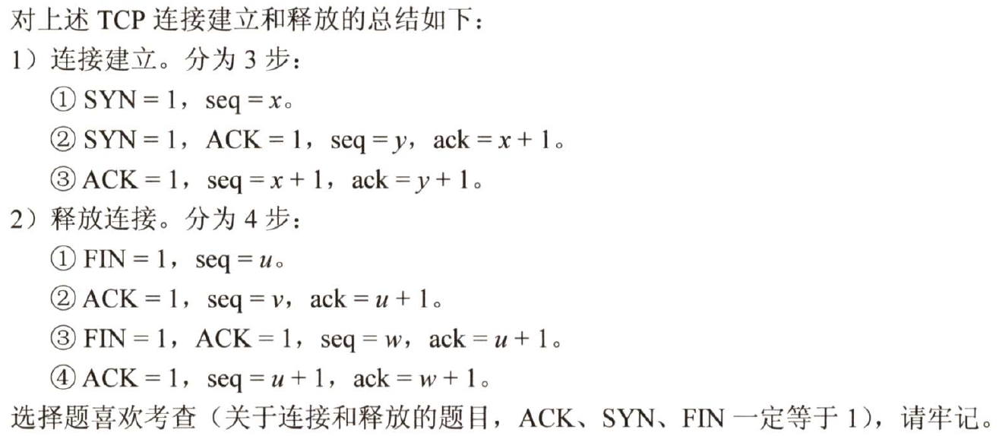

### 19. TCP 中的拥塞控制

掌握工作原理，会计算每轮的拥塞窗口和慢开始门限，注意区分慢开始和拥塞避免、快重传和快恢复两种方法。

- 慢开始就是从 1 个开始发，但是指数增长。“慢” 体现在一开始一次性只发 1 个报文；
- 拥塞避免是在 **超过阈值** 后线性增长的策略；
- 快重传是收到 **连续 3 个重复的 ACK** 之后，重传下一序号的策略，此后，**慢启动阈值** 被设置为 **当前拥塞窗口的一半**；
- 快恢复时不减到 1，只减一半。

## 填选复习范围

- 1 到 9：物理层
- 10 到 26：数据链路层 / 介质访问控制子层
- 27 到 34：网络层
- 35 到 36：传输层

### 1. 什么是三网合一？

- **电信网络**
  - 传输声音信号。强调实时性，可靠性要求一般，对带宽要求较低。
- **有线电视网络**
  - 传输视频信号。强调实时性，可靠性要求一般，对带宽要求较高。
- **计算机网络**※
  - 传输数据信号。强调可靠性，实时性和带宽要求一般。发展最快的并起到核心作用的是计算机网络。

### 2. C/S 和 B/S

#### i. C/S 客户-服务器

两层结构：客户端/服务器。客户端发起请求，服务端响应。

软件分客户端和服务器端两部分，**服务器端软件**安装好后，其他人还需要在客户端的电脑上安装专用的**客户端软件**才能正常浏览操作。

独立性强，单独升级客户机或服务器 “不影响正常工作”；优化网络利用率。

#### ii. B/S 浏览器-服务器

三层结构：浏览器/服务器/数据库。

软件只有**服务器端**，在服务器上安装相应软件和进行配置，客户端不需要进行任何安装和配置，使用**浏览器**就可以进行系统访问和系统控制。

实现瘦客户端，简化客户端电脑载荷，减轻了系统维护成本，降低用户的总体成本。

### 3. 常用电子商务形式

- B2B：商家对商家，_阿里巴巴_；
- B2C：商家对客户，_订书网站_；
- C2C：客户对客户，_闲鱼_；
- P2P：对等系统，_共享网盘_；
- OTO：线上到线下，_苏宁_。

### 4. 网络协议的三要素

网络协议（Network Protocol），简称为协议，是为进行网络中的数据交换而建立的规则、标准或约定的集合。

- **语法**
  - 数据与控制信息的**结构或格式**。
- **语义**
  - 需要发出**何种控制信息**，完成**何种动作**以及做出**何种响应**。
- **时序（同步）**
  - 事件**实现顺序**的详细说明。

### 5. 协议分层思想、分层后的数据传输

采用结构化设计（Structed Design），也就是划分层次：

- 发送端从高层传输到底层，逐层封装。
- 接收端从底层传输到高层，逐步解封。

相同层间，看似水平传输。但实际上需要那一层向下或向上传输。相同层获得的不直接来自其他机器的同层，而是来自于本机器的下一层或上一层。

（概念上可认为通信是水平的，但事实上水平通信要依赖垂直通信来实现。）

> 协议是“水平的”，服务是“垂直的”；
>
> 协议能实现一层内所有的功能，而服务是其中能被上层使用的一部分功能； 协议的实现保证了能够向上一层提供服务。

### 6. OSI RM

> 太简单了。——佳辛
> 对我来说不太简单。——0ls

OSI RM（开放系统互联参考模型）由 ISO 组织提出，目的是实现异种机互连。“开放” 表示任何两个遵守 OSI 标准的系统可以互连。“系统” 指计算机、终端或外部设备等。

#### i. OSI RM 结构

- Application: To allow access to network resources.
- Presentation: To translate, encrypt and compress data.
- Session: To establish, manage and terminate sessions.
- Transport: To provide reliable process-to-process message delivery and error recovery.
- Network: To move packets from source to destination; to provide internetworking.
- Data link: To organize bits into frames; to provide hop-to-hop delivery.
- Physical: To transmit bits over a medium; to provide mechanical and electrical specifications.

|     层     |                                功能                                 |                                    内容                                    | 数据单位 |
| :--------: | :-----------------------------------------------------------------: | :------------------------------------------------------------------------: | :------: |
|   物理层   |                   在物理介质上传输原始的比特流。                    | 定义了为建立、维护和拆除物理链路所需的机械的、电气的、功能的和规程的特性。 |  比特流  |
| 数据链路层 | 为它的上一层（网络层）提供一条无差错的数据链路（点-点：直接相连）。 |                       数据成帧、差错控制和流量控制。                       |    帧    |
|   网络层   |                   对整个通信子网的运行进行控制。                    |                    路由选择、阻塞控制、Qos 和网络互连。                    |   分组   |
|   传输层   |                 负责不同主机中两个进程之间的通信。                  |               分流与复用、端-端的差错控制和端-端的流量控制。               |   TPDU   |
|   会话层   |                 负责不同主机中两个用户之间的会话。                  |                       对话管理、令牌管理和数据同步。                       |   SPDU   |
|   表示层   |                   对数据/信息的语法表示进行变换。                   |                       数据变换、数据压缩和数据加密。                       |   PPDU   |
|   应用层   |                        为 OSI 用户提供服务。                        |  例如 FTAM（文件传送访问和管理）、MHS（文电处理系统）、VT（虚拟终端）等。  |   APDU   |

- TPDU（Transport Protocol Data Unit）：传输协议数据单元。
- SPDU（Session Protocol Data Unit）：会话协议数据单元。
- PPDU（Presentation Protocol Data Unit）：表示协议数据单元。
- APDU（Application Protocol Data Unit）：应用协议数据单元。

#### ii. 通信子网和资源子网的范围

？

### 7. TCP/IP RM

> 太简单了。——佳辛
> 对我来说不太简单。——0ls

TCP/IP RM 是 Internet 所使用的体系结构，目的是用于网络互连，是事实上的工业标准（从这个意义上说，ISO/OSI RM 可以说是法律上的国际标准）。

#### i. TCP/IP RM 结构

|     层     |                                            功能                                            |                                                                                                                          协议                                                                                                                           |
| :--------: | :----------------------------------------------------------------------------------------: | :-----------------------------------------------------------------------------------------------------------------------------------------------------------------------------------------------------------------------------------------------------: |
| 网络接口层 |                               传输经网际互连层处理过的信息。                               |                                                                                    未定义该层协议，而由互连的各网络使用自己的 DL（数据链路层）和 PH（物理层）协议。                                                                                     |
| 网际互连层 | 为数据传输提供不可靠的、面向无连接的服务（数据报服务）。路由选择、阻塞控制、分段和重组等。 |                                                                                                                    主要是 IP 协议。                                                                                                                     |
|   传输层   |                             为应用层实体提供端-端的通信功能。                              | TCP（传输控制协议）<br />提供可靠的、面向连接的数据传输服务，即：具有顺序控制、差错控制和流量控制功能。<br/>UDP（用户数据报协议）<br />提供不可靠的、面向无连接的数据传输服务，即：无顺序控制、差错控制和流量控制功能，而是将这些功能交给应用程序完成。 |
|   应用层   |                                为用户提供所需要的各种服务。                                |                                                                                                               Telnet、FTP、SMTP、DNS 等。                                                                                                               |

路由器在转发分组时最高只用到网际互连层，而没有使用传输层和应用层。

#### ii. 通信子网和资源子网的范围

？

### 8. 信道容量的含义和计算

信道容量的定义就是 **信道的最大信息传输速率**。

说容量，很可能让人以为它的单位是 `byte` 或者 `bit`。甚至可能让人误以为它指的是网络中可容纳的最大数据量。

**但实际上它表示的是速率（`bps`）。**

#### i. 有限带宽无噪声信道

$B$ 为最高码元传输速率，$C$ 为最高数据传输速率，$H$ 为低通信道的带宽，$N$ 为在某给定时刻码元可能取得离散值的个数。

- **理想低通信道** 的最高码元传输速率：$B = 2H$。
- **理想低通信道** 的最高比特传输速率：$C = B \log_2{N} = 2H \log_2{N}$。【奈奎斯特（Nyquist）公式】

虽然说是 $\log_2{N}$，但实际上这个对数值等于 **一个码元是由 $n$ 个比特组成的** 的这个 $n$。

> 课件里面这个 “四级数字信号” 属实把我整懵了。算了，说是可以代入到 $N$ 那就代。——佳辛

```
例题：电视频道的带宽是 6MHz，如果使用 4 级数字信号，则每秒钟最多可以发送多少位？假设电视信道为无噪声信道。
```

由 Nyquist 公式可知：

$$
C=2H \log_2{⁡𝑁}=2*6\operatorname{M}*\log_2⁡{4}=24\operatorname{Mbps}
$$

#### ii. 有限带宽高斯分布噪声信道

香农公式：$C = H \log_2\left(1+\dfrac{S}{N}\right)$

$S/N$ 是信噪比：$x\ \operatorname{dB} = 10 \log_{10}(S/N);\quad S/N = 10^{\frac{x}{10}}$

```
如果在一条 3kHz 的信道上发送信号，该信道的信噪比为 20dB，则最大可达到的数据传输速率是多少？
```

由 $20\operatorname{dB}$ 可以先求得 $S/N=100$。由香农公式可得：

$$
C = H \log_2\left(1+\dfrac{S}{N}\right)=3\operatorname{k}\times\log_2{(1+100)}\approx 20\operatorname{kbps}
$$

### 9. 传输介质：双绞线、光纤、通信卫星

我就不知道这玩意儿要咋考？？？

### 10. 基本调制技术：ASK、FSK、PSK

调制是使 **一种波形的某些特性** 按 **另一种波形或信号** 变化的过程或处理方法。

ASK/FSK/PSK (Amplitude/Frequency/Phase Shift Keying)

- 幅移键控法 ASK：用两个不同 **振幅** 的载波分别表示两个二进制值 “0” 和 “1”。
- 频移键控法 FSK：用两个不同 **频率** 的载波分别表示两个二进制值 “0” 和 “1”。
- 相移键控法 PSK：用两个不同 **相位** 的载波分别表示两个二进制值 “0” 和 “1”。

也就是说，**0** 和 **1** 在这三种调制技术调制后，会呈现不同的特征，如振幅一个高一个低、频率一个大一个小、相位相反。

### 11. PCM 计算数据传输速率

脉码调制 PCM（Pulse Code Modulation）技术基于 Nyquist 理论：若对连续变化的模拟信号进行周期性采样，只要采用频率大于等于有效信号最高频率或其带宽的两倍，则采用值便可包含原始信号的全部信息，利用低通滤波器可以从这些采样中重新构造出原始信号。

1. 采样：根据采样频率对模拟信号进行周期性采样，得到一系列模拟值。
2. 量化：定量化级，将采用得到的模拟值按量化级进行 “取整”，得到一系列离散值。
3. 编码：将量化级数字化，得到一系列二进制值，最后将二进制值进行编码，得到数字信号。

#### T1 载波

对于一个带宽为 $4\operatorname{kHz}$ 的声音信道，根据 Nyquist 理论，采样频率应为 $8000\operatorname{Hz}$，即采样时间为 $125\operatorname{\mu s}$ （电话网络中几乎所有的时间间隔都是 $125\operatorname{\mu s}$ 的倍数）；每次采样值可以生成一个 $7 \operatorname{bit}$（量化级为 128 级）或 $8\operatorname{bit}$（量化级为 256 级）的数值，则一条数字线路应达到 $56 \operatorname{Kbps}$ （8000 次 × 7 bit/1 秒 ）或 64 Kbps （8000 次 × 8 bit / 1 秒 ）才能不失真地传输声音。

利用 PCM 和 TDM 技术，使 24 路声音采用信号复用一个线路。

- 模拟传输：24 路话音信道，每条 $7 \operatorname{bit}$ 数据 + $1 \operatorname{bit}$ 信令
- 数字传输：23 条用于数据传输，第 24 条信道用于信令

传输速率是 $1.544\operatorname{Mbps}$，传输一帧的时间是 $125\operatorname{\mu s}$，帧结构由 $193 \operatorname{bit}$ 组成一帧，共 24 个信道（每个 $8\operatorname{bit}$，$7\operatorname{bit}$ 数据 + $1\operatorname{bit}$ 控制位）和 $1\operatorname{bit}$ 控制信息组成。各数据由来：

- $24\times (7+1)+1=193\operatorname{bits}$
- T1 标准的数据传输速率：$7\operatorname{bits}/125\operatorname{\mu s}=56\operatorname{kbps}$
- T1 标准的控制信息传输速率：$1\operatorname{bit}/125\operatorname{\mu s}=8\operatorname{kbps}$
- 总传输速率：$193\operatorname{bits}/125\operatorname{\mu s}=1.544\operatorname{Mbps}$

### 12. CRC：作用、算法、生成多项式的实现（硬件）

#### i. 作用

这玩意儿是 “线性” 检错码。

#### ii. 算法

异或。把被除数和除数都想象成有限域内多项式，做的除法是多项式的模 2 除法。由于是多项式，**低位和高位之间有不可逾越的次数差距**，不存在什么进位和借位。

- 一开始，如果除数有 $n$ 位，就往 **被除数** 后面接 $n-1$ 个 **0**。
- 接着，模 2 除法，除到 **被除数无法落位到最新余数后面**。
- 最后，舍弃 “商”，用 $n-1$ 位的 **最新余数** 填补那一开始接上的 $n-1$ 个 **0**，目的是做到 **将余数加到被除数上，使 (被除数 + 余数) 可以被除数整除**。

#### iii. 电路

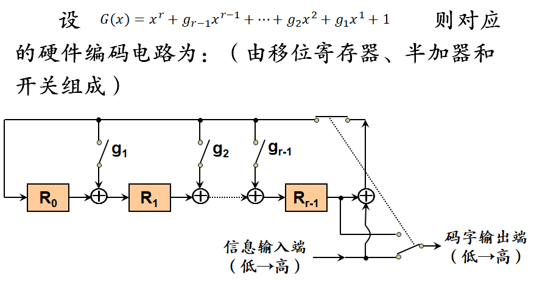

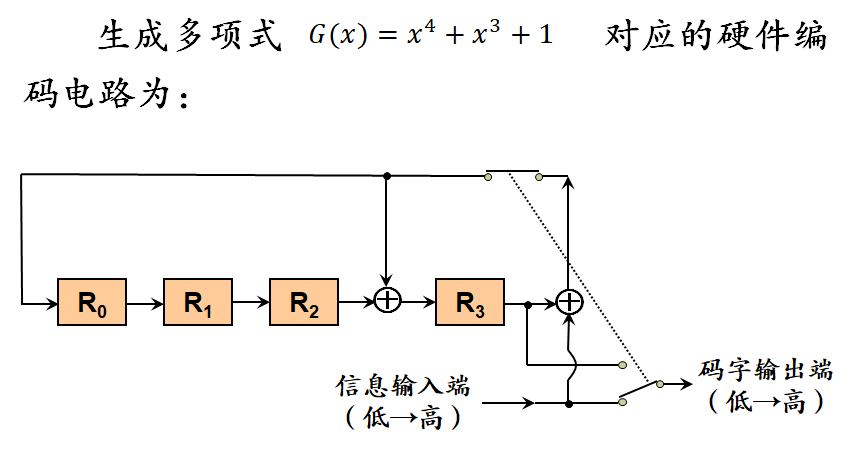

输入数据 `1101010` 后的工作过程：

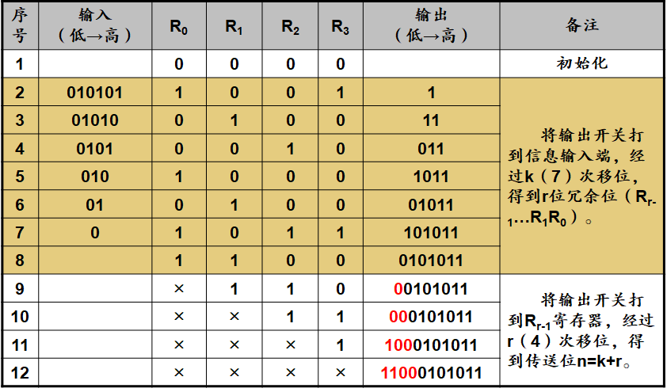

### 13. 海明码：纠正一位错的冗余位设计（会计算所需冗余位数）

海明码是纠错码。

- 想要检 $d$ 比特的错，就得使用海明距离为 $d+1$ 的编码；
- 想要纠 $d$ 比特的错，就得使用海明距离为 $2d+1$ 的编码。

$k$ 是数据位长度，$r$ 为校验位长度，$n$ 为码字位数：

$$
2^r\ge k+r+1
$$

> 证明如下：
>
> 码字是什么？就是信道一次发送的东西，码字位数就是一次发送的东西的位数。里面真实传输的数据位数就是数据位长度；不是信息位的长度总和就是校验位长度。
>
> 什么叫 **非法码字**？就是在某种检错码机制下，在传输中不应该出现的码字。由于有 $n$ 位码字，所以 $2^k$ 个可能的有效数据中的每一个，都会有 $n$ 个海明距离为 1 的非法码字。
>
> $n$ 位总共有 $2^n$ 中可能数据，每个有效数据对应一种校验，也就是说有 $2^k$ 种合法码字。上面说了，$2^k$ 中的每一个都会有 $n$ 个非法码字，所以加起来就是 $1+n$ 种比特模式。
>
> 总的来说有这么一个限制：$(1+n)\times2^k \le 2^n$。这是必然的，因为必须小于，$2^n$ 可是总数了！
>
> ——佳辛

### 14. 多路复用技术的原理与比较，CDMA 要计算接收数据

多路复用的意思就是把 **同一条通信链路** 分出多条 “子路”，并且同时传输信号。

- FDM：频分多路复用，载波带宽被划分为多种不同频率带的子信道，多个子信道间可以并行传送数据，也就是用不同频率传送各路消息，实现多路通信。
- TDM：时分多路复用，用不同信道或时隙的交叉位脉冲，在同一个媒介上传输多个数据。
- WDM：波分多路复用，用不同波长的光载波信号，经复用器汇在一起，在同一根光纤中传输多种波长的光信号。
- CDM / CDMA：码分多路复用，用不同的编码格式编码 0 和 1，发送方合并，接收方分离。

有关 `CDMA` 计算接收数据，就是接收方的解码分离过程。

假设这里有两个不同的发送端，它们各自维护一个 **芯片序列**。

- 当它想要发送 **1** 的时候，就 **直接发送这个序列**；
- 当它想要发送 **0** 的时候，就 **发送芯片序列的反码**。

1. 检验：对两个不同发送端的 **芯片序列** 做内积。如果 **内积为 0**，则可以发送；
2. 发送：将两个不同发送端 **想要发送的序列** 直接线性相加；
3. 解码：将发送端 **芯片序列** 和接收到的结果一起做 **规格化内积**，得到的结果为 1，那么就是 1；如果是 -1，那就是 0。_（“规格化内积” 就是要除以模长）_

```chinese
比如 A 端使用 (+1,-1,-1,+1,+1,+1,-1,-1)，B 端使用 (-1,+1,-1,+1,-1,+1,+1,-1)。
如果接收到的数据为 (-2,+2, 0, 0,-2, 0, 0,+2)，那么 A/B 二端传输的分别是什么。

  (-2,  +2,  0,  0,  -2,  0,  0,  +2)
  (+1,  -1, -1, +1,  +1, +1, -1,  -1)
= (-2 + -2 + 0 + 0 + -2 + 0 + 0 + -2) / 8 = -1，所以 A 传的 0

  (-2, +2,  0,  0, -2,  0,  0, +2)
  (-1, +1, -1, +1, -1, +1, +1, -1)
= ( 2 + 2 + 0 + 0 + 2 + 0 + 0 + 2) / 8 = 1，所以 B 传的 1
```

### 15. 数据链路层成帧的四种方法

重点是面向比特的首位定界符法，掌握 0bit 插入/删除。

- 字节计数法
- 字节填充的标志字节法
- 比特填充的标志比特法
- 物理层违禁编码法

> 连续的 5 个 1 之后，必定接着 1 个 0。这是因为它的头尾都是 `0x7e`。——佳辛
> 我看不懂。——0ls

#### 使用比特填充的首尾定界符法

- 思想：采用一特定的比特组合（例如：`01111110`）来表示一帧的开始和结束。

- 例子：HDLC（高级数据链路控制）协议

- 透明性传输：如果传输的数据中出现用于定界的比特组合，会干扰传输，此时可采用“0 比特插入/删除法”实现数据的透明性传输。

- 特点：

  - 协议不依赖于任何一种字符编码集；
  - 用于实现数据的透明性传输的“0 比特插入/删除法”易于硬件实现。

  下面使用一个特定的比特模式，即 `01111110` 来标志一帧的开始和结束。为了不使信息位中出现的比特流 `01111110` 被误判为帧的首尾标志，发送方的数据链路层在信息位中**遇到 5 个连续的 “1” 时，将自动在其后插入一个 “0”**；而接收方做该过程的逆操作，即每收到 5 个连续的 “1” 时，自动删除后面紧跟的 “0”，以恢复原信息。

  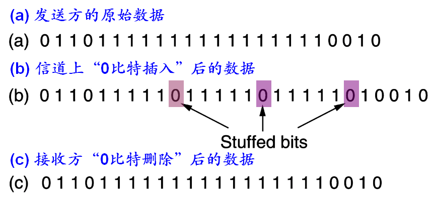

### 16. 自动重发请求协议 (ARQ) 确认+定时器+帧编号

发送方发送数据，接收方接受之后进行检测：

- 如果对，就让对方继续发；
- 如果错，就让对方重发。

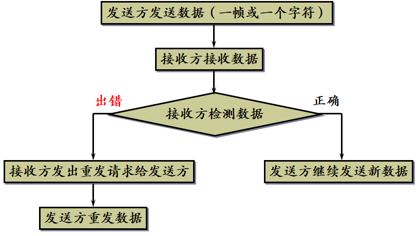

- **确认** 就是让对面继续发的那个 `ACK`；

- **定时器** 防止整个数据帧或反馈信息丢失；
- **帧序号** 防止接收方多次收到同一帧并递交网络层。

### 17. 滑动窗口协议与停-等协议、后退 N 帧协议、选择重传协议的关系

#### 滑动窗口

- 发送端设置发送窗口控制发送流量
- 接收端设置接收窗口控制接收流量
- 设置原则：$\text{发送流量}\le\text{接收流量}$
- 全双工通信则通信双方都应同时设置发送和接收窗口

#### 发送窗口

- 每个发送端设置一个，用于保存待确认帧的序号（即：对应发送方已发送但未收到确认的数据帧序号，数据必须顺序发送）。初始为 0，有最大限制，窗口大小是动态改变的。
- 每发送一个数据帧，上限向前滑动一步；
- 每接收一个确认帧，下限向前滑动一步/多步；
- 上限和下限之差为最大尺寸时，停止发送。

#### 接收窗口

- 每个接收端设置一个，用于保存期待接收帧的序号（即：对应接收方允许接收的数据帧序号，可以非顺序接收）。窗口尺寸有最大限制，但窗口大小始终是固定的。
- 对接收到的数据帧，只有其序号落在接收窗口范围内才接收，否则丢弃；
- 对正确接收的数据帧，产生一个确认帧，接收窗口向前移动一个窗口大小的位置。

从窗口大小进行比较，记住发送窗口的最大值。

|     协议      |     发送窗口 $W_T$     |      接收窗口 $W_R$       |
| :-----------: | :--------------------: | :-----------------------: |
| 滑动窗口协议  | 初始为 $0$，有最大限制 |     窗口大小始终固定      |
|   停-等协议   |          $1$           |            $1$            |
| 后退 N 帧协议 |    $1<W_T\le 2^n-1$    |           $=1$            |
| 选择重发协议  |   $1<W_T\le 2^{n-1}$   | $1<W_R\le W_T\le 2^{n-1}$ |

#### i. 停-等协议

发送窗口 = 1；接收窗口 = 1。

#### ii. 后退 N 帧协议

接收端只保存 1 个期望的帧序号，也就是说只盯着一个序号看，其他的都丢弃。由于接收窗口大小为 1，因此后退 `N` 帧保证了 **帧的有序到达**。

发送窗口 > 1；接收窗口 = 1。

#### iii. 选择重传协议

由于选择重传并不一定要求有序到达，接收窗口的大小大于 1。

发送窗口 > 1；接收窗口 > 1。

且两窗口大小一定要小于 $2^{n-1}$，$n$ 为帧序号。

### 18. 计算采用停-等协议的信道利用率

在停-等协议中，发送方发送数据包并等待数据包的 ACK（确认）。一旦 ACK 到达发送方，它就连续发送下一个数据包。如果没有收到 ACK，它就再次重发前一个数据包。

※记 $T_D$ 为发送时延，$RTT$ 为往返时延，$T_A$ 为接收时延，那么对于 1-bit 滑动窗口协议（停等协议），每个时间间隙只发送 1 帧数据，信道利用率

$$
U = \frac{T_D}{T_D+RTT+T_A}
$$

```
50kb/s 的卫星信道上采用停-等协议，帧长度为 1000bit，卫星的上行和下行链路的延时都为 125ms，不考虑误码率且假设确认帧的处理时间可以忽略，计算该卫星信道的利用率。
```

解：$50\operatorname{kb/s}$ 的卫星信道上发送帧长度为 $1000\operatorname{bits}$ 的数据帧所需时间为 $1000/50\operatorname{k}=20\operatorname{ms}$。卫星的上行和下行链路的时延都为 $125\operatorname{ms}$，故数据帧到达接收方及确认帧返回所需时间为 $2*(125+125)=500\operatorname{ms}$。不考虑误码率且假设确认帧的处理时间可以忽略的情况下，该卫星信道的利用率为 $\dfrac{20}{20+500}=3.8\%$。

### 19. PPP 协议的组成

- 串行链路上封装 IP 数据报的方法（数据成帧）
  - 既支持异步链路（以字符单位进行传输），也支持面向比特的同步链路（例如：SONET/SDH）。
- LCP（Link Control Protocol）
  - 用来建立、维持和拆除数据链路，还有测试线路及协商选项等功能。
- NCP（Network Control Protocol）
  - NCP 是多个协议的总称，以与网络层无关的方法协商网络层选项，不同的网络层协议有不同的 NCP，例如：适用于 IP 的 IPCP、适用于 IPX 的 IPXCP 等。

特点是不可靠传输。需要注意的是这道题可能考 **计算协议帧的长度**。

| 名称 |  F  |  A  |  C  |  协议  |     信息部分     |  FCS   |  F  |
| :--: | :-: | :-: | :-: | :----: | :--------------: | :----: | :-: |
| 内容 | 7E  | FF  | 03  |  不定  |    IP 数据报     |  不定  | 7E  |
| 长度 |  1  |  1  |  1  | 1 或 2 | 不超过 1500 字节 | 2 或 4 |  1  |

这个长度都是按字节来分的。有一些 `Optional` 的长度，那都是可协商的。

对于协议部分：

- 最高位为 0：说明信息部分是网络层协议；
- 最高位为 1：说明信息部分是 **PPP 的配置协议**。

协议部分 **默认是两个字节**，但是可以通过 **LCP 协议** 协商成 1 个字节。

信息部分在无协商情况下，默认是 1500 字节。在不足时，通过填充补足空余部分。可以通过 **LCP 协议** 协商成任意大小。（是吗？）

校验和字段一般是 2 个字节，但可以被 **LCP 协议** 协商成 4 个字节。

所以一个 **PPP** 帧，默认为 $(1+1+1+2+1500+2+1) = 1508$ 字节；最小可协商为 $(1+1+1+1+0+2+1) = 7$ 字节；最大可为 $(1+1+1+2+1500+4+1) = 1510$ 字节。

### 20. CSMA/CD：思想、本质、会最短帧长的计算

- CSMA 的思想：**先听后说**
  - 数据发送前，先侦听信道，判断是否有数据，以降低冲突。
- CD 的思想：**边说边听**
  - 发送方一边发送，一边监听，一旦检测到冲突，则冲突双方都立即终止发送，然后再按某一算法延迟一段时间后重新发送。
- **CSMA/CD 的本质**
  - 采用 CSMA 可**降低冲突次数**，采用 CD 可**降低一次冲突所造成的损失**。同时采用 CSMA/CD 就可以**将冲突所造成的总损失降低到可以接受的程度**。

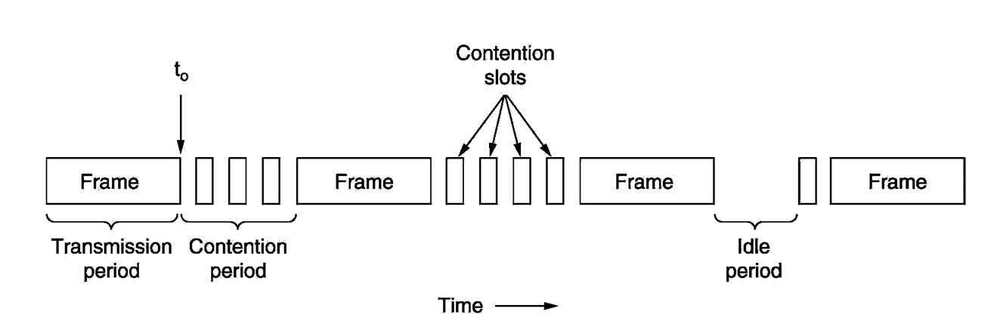

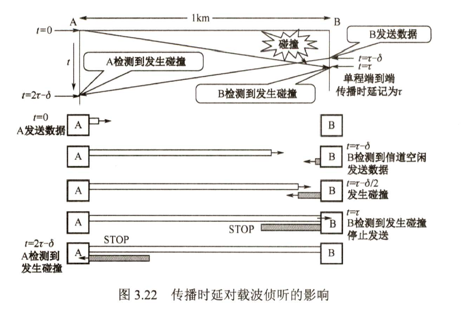

**CSMA/CD** 的思路：

1. 发消息前进行检测，如果无冲突，则（等待最小间隔后）发送；
2. 发送时，也要时刻检测链路上是否发生冲突（通过检测 “链路上传输出去的信号是否与读回的信号是否相同” 来判断）；
3. 一旦检测到冲突，就立刻停止发送，隔随机的一段时间后，开始做第 1 步。

**帧间的最小间隔** 为 $9.6 \operatorname{\mu s}$。

也就是说，检测到总线空闲后，也还至少需要等待 $9.6 \operatorname{\mu s}$ 才能再次发送数据。（但这个在计算 “最短帧长” 的时候并不重要）

最重要的是第二点：**发送时，也要时刻检测链路上是否发生冲突**。可以设发送端到接收端的传播时延为 $\tau$。假设现在 **在链路上某点** 发生了确确实实的冲突，可是发生冲突的时候，**无论是发送端，还是接收端**，都还 **不知道冲突的发生**（光速限制）。

由于 “**通过检测读回信号判断是否冲突**”，至少要等到 **接收方数据** 传到 **发送方** 时，**发送方** 才知道冲突的发生。

相较于 **发送方发送出数据的那一刻**，要经过 $2\tau-\delta$ 的时间，自己才知道冲突的发生（$\delta$ 是一个变量，与接收方发送数据的时间有关，$\delta \in \left[0, \tau\right]$）。

但是，很有可能帧太短了，以至于 **帧发送完毕之后，才把有关帧的冲突传回来**。这个时候发送方肯定是不认的。所以需要设置一个 **最短帧长**。

最短帧长就是需要 **发送方还在发送它的时候，接收到了有关它的冲突**。

```chinese
1km 电缆建立一个 1Gbps 速率的 CSMA/CD 网络。信号在电缆上传播速率为 200000km/s。求最短帧长。

2 × (1km / 200000km/s) = x / 1Gbps，有 x = 10kbit
```

为了确保发送站在发送数据的同时能检测到可能存在的碰撞，需要在发送完帧之前就能收到自己发送出去的数据，即帧的传输时延至少要两倍于信号在总线中的传播时延，所以 CSMA/CD 总线网中的所有数据帧都必须要大于一个最小帧长。任何站点收到帧长小于最小帧长的帧时，就把它当作无效帧立即丢弃。最小帧长的计算公式为

$$
\text{最小帧长}=\text{总线传播时延}\times\text{数据传输速率}\times 2
$$

### 21. 自适应树遍历协议：会计算通信时隙数

在书上的 212 页，课件第四章 49 页（站点 G 和 H 同时请求获取信道）。

- 站点分组：采用二叉树（树叶：站点，树枝：分组）。
- 竞争信道
  - 若第 0 时隙无冲突，则要么无站需发送，要么仅有一个站需发送，且发送成功；
  - 若第 0 时隙发生冲突，则采用深度优先搜索法，从左至右搜索该树。

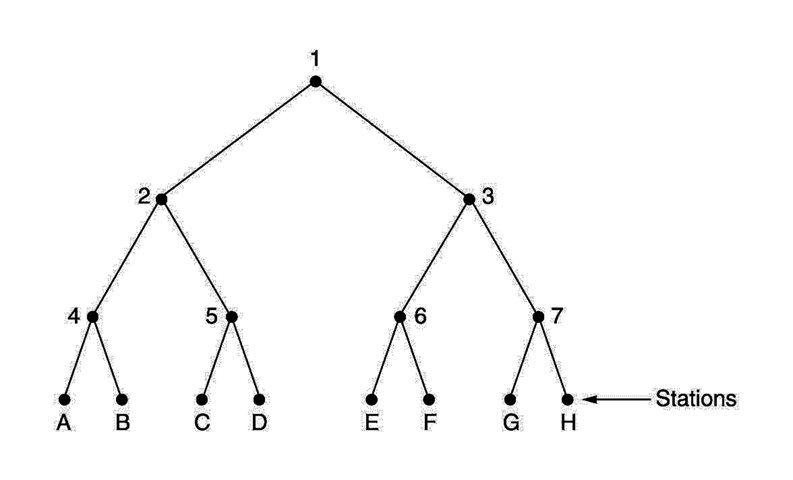

题目差不多会给一个树，然后说那两个节点同时想要发送数据。然后问第几个时隙有节点获得信道。

对于一个树节点（非叶子节点相当于一个 **槽**，包括根节点），它冲突的条件是 **其下所有叶子节点中，有两个以上节点同时想要发送数据**。比如课件上的就是 **G, H** 同时想要发送，进而导致 **1, 3, 7** 节点冲突。

需要注意的是，**时隙 0** 也算在内，意为 **检测到根节点冲突**。同时，对一个节点的检查可看作 **需要消耗一个时隙的时间**，对根节点的检查也是。因此对课件上的例子，也就有：

- 时隙 0：检测到根节点冲突；
- 时隙 1：检测 2 节点，无请求；
- 时隙 2：跳过节点 3，直接检测 6 节点，无请求；
- 时隙 3：跳过节点 7，直接检测 G 节点，为站点，直接令 G 获得信道。

最后再强记一个公式，$i = \log_2{q}$，$q$ 为发生冲突的叶子节点数目，$i$ 为开始遍历的最优层级（根节点算第 0 级），因为第 $i$ 层的非叶子节点，其下叶子节点占整个树的 $2^{-i}$，期望 $q \cdot 2^{-i} = 1$。

### 22. 以太网产品的分代

> 这谁知道咋考啊？课件 54 页到 117 页都是讲以太网分代。——佳辛

我只知道分为 **传统以太网、快速以太网、千兆以太网、10 G 以太网**。

- 快速以太网：是传统以太网的快速版，100 Mbps；
- 千兆以太网：1 Gbps，仍与以太网标准向后兼容，同时支持半双工和全双工；
- 10 G 以太网：还是保持向后兼容，全双工通信，不使用 CSMA/CD。

### 23. MAC 地址：格式和应用

也称为硬件地址、物理地址，局域网上的计算机利用 MAC 地址表示自己和他人的身份。

MAC 地址通常存储在网络接口卡 NIC 中。

IEEE802 标准规定 MAC 地址可采用 6B（常采用）或 2B，采用十六进制表示，例如：

<center>02 – 60 – 8C – 01 – 2C – 4A</center>

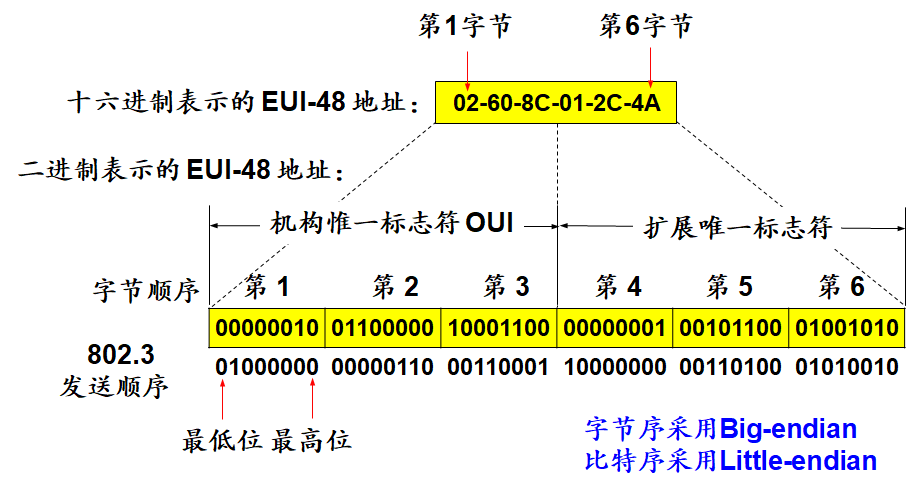

#### MAC 帧

| 名称 |                       前导码                       |   dst    |   src    |         长度/类型         |  数据  |              填充              | FCS |
| :--: | :------------------------------------------------: | :------: | :------: | :-----------------------: | :----: | :----------------------------: | :-: |
| 长度 |                         8                          |    6     |    6     |             2             | 0~1500 |              0~46              |  4  |
| 备注 | DIX 全是 1010，802.3 有 7 字节同步码和一字节定界符 | 全球唯一 | 全球唯一 | 区分 XIC/802.3 的唯一字段 |   无   | 和数据的总和一定要大于 46 字节 | 无  |

8 字节前导码，包括 7 字节同步码和 1 字节的 **MAC 帧开始** 定界符。

**MAC 帧** 里面首先是目标地址和源地址，都是 **MAC 地址**，各占 6 个字节。此后是类型或长度，再次是最小 46 字节、但最大 1500 字节的数据，后跟检验和。

- 类型字段的值都大于 1500（实际上是 1536），所以限制了数据段必须小于 1500。
- 必须要有 **填充** 来确保帧的总长度大于 64 字节。不然很有可能 “发生了冲突，但由于帧太短，整个发送过程提前结束，而不响应、处理冲突”。

### 24. 以太网交换机的交换方式、工作过程、总带宽的计算

以太网交换机见第四章课件 94 页，书上的 264 页。

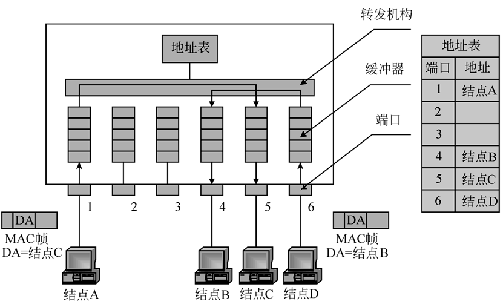

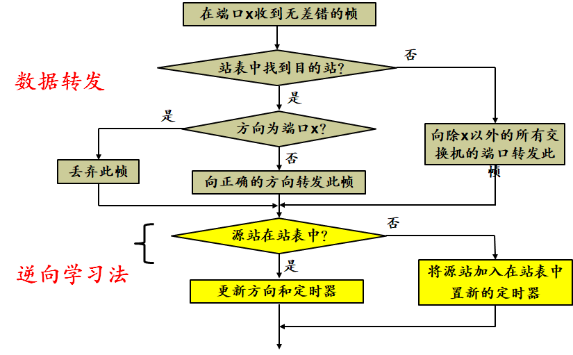


以太网交换机有很多 “可供一端连接计算机节点的双绞线直接插入” 的端口。每个端口都在交换机内部设有一个 **缓冲器**，缓冲器好似一个队列，用于存储交换机还未来得及处理的帧。交换机中维护着一个 **端口-地址表**，对于每个从 **缓存器** 中获取的 **帧**，都可以使用 **帧中物理地址**，判断该送往哪个端口。

这是交换机的总架构，根据对 **帧** 处理方式的不同，又可以分成如下三种交换方式。

#### i. 存储-转发

交换机内部有缓冲区，使用 **存储-转发** 方式进行转发。收到发送过来的数据，先把它存在缓冲区中，在缓冲区中可以检测帧是否有差错；由于使用了缓冲区，可以轻松做到不同速率端口间的转发。

#### ii. 切入法

检测到地址后**马上转发**，不检错，也不存起来。

好处就是快。

#### iii. 改进型切入法

综合前两者，不存储，但是会进行一些处理：将帧的前 64 字节，检查是否有误。如果无误，立刻转发。

> （这就很奇怪，它是怎么检查的？）——佳辛
> （可能是碰运气吧。）——0ls

#### iv. 计算总带宽

我猜测题目大概会给出交换机中各端口的吞吐量，然后算理论总带宽（“线速背板带宽”）。或者反过来：

```chinese
如果以太网交换机的总带宽为 8.4Gbps，并且有 22 个全双工百兆端口，则全双工千兆的端口最多为？

全双工千兆口数为 (8.4Gbps - 22 × 2 × 0.1Gbps) / (2 × 1Gbps) = 2
```

### 25. 以太网中的冲突域和广播域

网桥隔离冲突域，路由器隔离广播域。

如果两个站点同时检测到介质空闲并同时发送出一帧数据，就会导致数据帧的冲突，使得双方的数据帧都会遭到破坏。这时，两个站点将采用二进制指数退避的方法各自等待一段随机的时间再进行侦听和数据发送。

- 第一层设备（如中继器、集线器）不能划分冲突域和广播域；
- 第二层设备（如网桥、交换机）能划分冲突域，但不能划分广播域；
- 第三层设备（如路由器）既能划分冲突域，又能划分广播域。

### 26. IEEE 802.11 的 MAC 协议：DCF 和 PCF

总的来说：

- **DCF** (Distributed Coordination Function)：分布式接入，让各站争用信道，从而获得发送数据的权力；
- **PCF** (Point Coordination Function)：轮询法，理论上无竞争，所有的带宽由一个全局 **Point** 控制，将发送数据的权力轮流交给各个站点。

**DCF 以 CSMA/CA 作为默认接入方式**，有关的内容应该看 **CSMA/CA**，而非深究 **DCF**。

这两个玩意儿 **PCF** 是可选的接入方式，而 **DCF** 是必选的。

> （但我并不懂可选/必选是什么意思）——佳辛

### 27. IEEE 802.11 中的信道预约：RTS/CTS

特别注意 IFS 的使用。

#### i. RTS (Request To Send)

源站 A 在发送数据帧前先发送一个短控制帧：RTS 帧，它包括源地址、目的地址和这次通信（包括相应的确认帧）所需的持续时间。

#### ii. CTS (Clear To Send)

若媒体空闲，则目的站 B 就发送一个响应控制帧：CTS 帧，它包括这次通信所需的持续时间（从 RTS 帧中将此持续时间复制到 CTS 帧中）。

A 收到 CTS 帧后就可发送其数据帧。

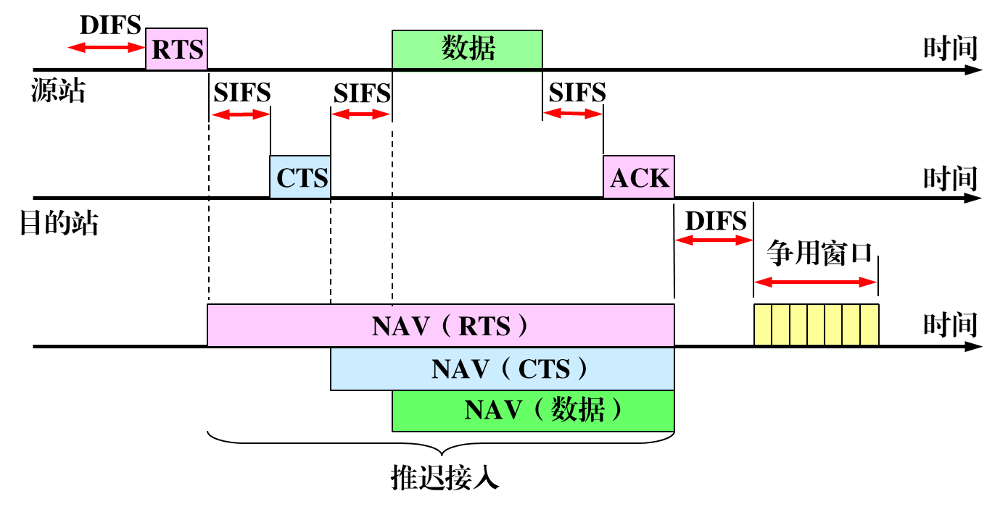

#### iii. IFS (Interframe Space)

所有的站在完成发送后，必须再等待一段很短的时间（继续监听）才能发送下一帧。这段时间就是帧间间隔 IFS。

帧间间隔长度取决于该站欲发送帧的类型，高优先级帧 IFS 较短，因此可优先获得发送权，这样既可以减少发生碰撞，也可以实现服务质量。

SIFS：$28\operatorname{\mu s}$；DIFS：$128\operatorname{\mu s}$

### 28. VLAN 的基本概念

虚拟局域网（VLAN）是建立在支持 VLAN 功能的交换机（或网桥）的基础上，它是以软件的方法将网络中的节点按工作性质与需要划分成若干个 “逻辑工作组”，每个逻辑工作组就是一个逻辑子网，逻辑子网也具有物理子网相同的网络性能，一个 VLAN 就是一个广播域。

组网依据：VLAN 是一个逻辑子网，其组网的依据不是物理位置，而是逻辑位置。

重要特征：同一 VLAN 的所有成员组成一个 “独立于物理位置而具有相同逻辑的广播域”；VLAN 通过软件实现 VLAN 成员的增加、移动和改变。

### 29. 层次路由，会计算路由表中的表项数

就是对于一个路由器而言，它如果能和整个网络中的所有路由器通信，需要多少表项。

- 首先，任意路由器必须有其区域中 **所有路由器** 的地址；
- 其次，任意路由器必须有一个到 **同层次其他区域** 的地址；
- 最后，任意路由器必须按照第二条规则，拥有其他所有大层次（簇/区/群）的地址。（按照题目分析）

但总的来说，最重要的就是 **确保每台路由器都可以和网络中任何一个路由器通信**。

### 30. 组播路由中的核心基本树

要求会计算使用 / 不使用核心基本树网络所需保存的树的数目。

#### i. 不使用核心基本树

一个子网里面有 $n$ 个组，假设每个组平均有 $m$ 个成员。那么如果 **不使用核心基本树**，网络中每个路由器需要存储 $mn$ 棵不同的树。

**“每个路由器都要存 $mn$ 棵树”** 这件事可能很难理解。其实是这样的：

路由器要做的事情无非是告诉 **任意** 数据包下一跳该去往何方。对于一个路由器来说，如果它只存路由表，肯定不能做到按组播树传播。因为按路由表走，它只会按 `Dijkstra` 给出的路线走。所以路由器必须要存组播树。（按照我的理解的话）

对于某一个节点来说，**以它为起点** 的 **某一个组** 的组播树，与 **同组中其他节点** 的组播树（也以它们自己为起点）一定不一样。（为什么不一样？不说别的，网络中任意两个节点的最小生成树能一样吗，如果不一样的话，组播树为什么会一样）

上面说了，路由器不能按照路由表去找下一跳。

对于一个 **IP 包**，里面是记录了 `src` 与 `dst` 的。想要按照组播树路线走，那只能让路由器通过包中给出的 `src & dst` 查找 **自己已经存储好的组播树**。而同组的组播树，又因 **起点的不同而各不相同**，对于一个 $m$ 个成员的组，网络中的路由器只能被迫记住 $m$ 个组播树。若整个网络中有 $n$ 个组的话，就必须记住 $nm$ 个组播树了。

#### ii. 使用核心基本树

如果使用 **核心基本树**，原理是令同组不同节点的组播树强制相同。

组中发送数据，必须先发到一个核心节点，然后再由核心节点转发到那个节点。

所以对于一个有 $n$ 个组的网络，无论每个组中有多少成员，每台路由器都只需要存储 $n$ 个组播树。

### 31. 移动主机的路由选择：三角路由

按照课件的说法，**每个移动主机都有一个永久的家乡地址**。

这里会有一个叫做 **家乡代理** 的服务，它一直待在 “家乡”。移动主机到了一个地方，会主动向家乡代理 **注册** 自己新的位置。

这样，当下一次有机器向移动主机发送数据时，家乡代理可以通过 **隧道** 转发分组。在移动主机接到 **来自家乡代理** 的数据包时，会拆开隧道封装，获取内部报文，直接响应内部报文的 `src`。

此后，发送者会通过 **隧道** 绕过家乡代理，直达真实目标地址。

如果把机器和机器之间看成 “端到端”，那么课件上的第 1 步到第 4 步就不仅仅是逻辑上的三角，也是物理上的 “三角”。

### 32. RSVP 协议

**RSVP** 是服务质量一节中 **综合服务体系结构** 中的协议。

允许多个发送方对多个接收方。允许接收方自由切换频道。

路由器并不在意接收方到底在看什么，路由器只关心它和接收方的 **协商**。如果新频道同意之前的协商（要求的参数小于先前的协商参数），那就什么都不用做。

需要注意的是：

- 和日常生活中看视频一样，这里是 **接收方选择数据源**。接收方在协商时可以做有关 **“未来是否有更换数据源”**、**“资源预留协商完成后，资源参数是否固定不变”** 的讨论；
- 多个接收方可以共享一条路径；
- 两个不同源肯定用两条完完全全独立的信道，哪怕它们有部分相同的路径；
- 同源会在末稍处用两条独立的信道，但如果 **它们有部分相同的路径**，那么在那些路径上都是 **用同一条信道**；
- 是接收方在最开始 **请求** 发送方发送；

### 33. IPv4 地址，注意私有地址和特殊地址

#### i. 私有网 IP 地址

见课件第五章 160 页，按传统分类地址方法：

| 类  |          网络号           | 网络总数 | 地址总数 |
| :-: | :-----------------------: | :------: | :------: |
|  A  |         10.0.0.0          |    1     | $2^{24}$ |
|  B  |   172.16.0.0~172.31.0.0   |    16    | $2^{20}$ |
|  C  | 192.168.0.0~192.168.255.0 |   256    | $2^{16}$ |

#### ii. 特殊 IP 地址

见课件第五章 153 页。

|        种类        | Netid | Hostid | 用作源地址 | 用作目的地址 |
| :----------------: | :---: | :----: | :--------: | :----------: |
|      网络地址      | 特定  |  全 0  |    不可    |     不可     |
|    直接广播地址    | 特定  |  全 1  |    不可    |     不可     |
|    受限广播地址    | 全 1  |  全 1  |    不可    |     可以     |
|  本网络上的本主机  | 全 0  |  全 0  |    可以    |     不可     |
| 本网络上的特定主机 | 全 0  |  特定  |    可以    |     可以     |
|      环回地址      |  127  |  任意  |    不可    |     可以     |

### 34. CIDR：重点掌握路由聚合和最长前缀匹配的使用和应用

为方便表示网络中不定长度的子网掩码，用 **CIDR (Classless Inter-Domain Routing)** （画斜线表示掩码）的标记方法来代替 **网络号+子网号**。

那么很明显，在路由器中，应该用 **最长前缀匹配** 方式来决定某包的下一跳地址。（如果不是最长前缀，那就飞到其他子网里面了，第一步走错后，不可能在那个 **非最长前缀** 的子网中找到目标子网）

**链路聚合** 与划分子网几乎是相反的，它是把多个 “长前缀” 的子网合并成一个 “短前缀” 的网络。这样路由器不需要存所有 “长前缀” 子网，而只需要存一个个 “短前缀”，存的东西会少一些。我猜这部分的题目肯定是给几个地址，然后问链路聚合之后的 “短前缀” 是多少之类的……

### 35. TCP 协议的流量控制

**动态滑动窗口协议** 可以同时实现 **流量控制和拥塞控制**。

对于流量控制，具体体现在：**发送端窗口大小取决于接收端可用的缓冲区容量**。

### 36. TCP 协议的连接建立和连接释放的具体过程

经典的三次握手、四次挥手：

```chinese
Host1                       Host2
SYN, seq=x        ------>
                  <------   SYN, seq=y, ACK=x+1
seq=x+1, ACK=y+1  ------>
```

双方各自发送自己的 `seq`。返回的确认帧 `ACK` 是 `seq+1`。

有必要说明，`seq` 是 **已发送的最后一个段的序号**，`ACK` 是 **期望对方发送的下一个段的序号**。

这里从多个角度理解三次握手：

三次握手可以防止 **发起者旧、重复连接请求**，也就是 **失效的连接请求报文段突然传到接收方** 造成的问题。

三次握手中，由 **接收端向发送端发送** 的 `ACK`，是为了告诉发送端，自己已经接收到了发送端发来的第一个 `SYN`；而 **发送端向接收端发送的第二次** `ACK` 则是告诉接收端，自己收到了对方发来的 `SYN+ACK`。也就是说：**后面的两次，都是在告诉对方，“我收到了上一条信息”**。

三次握手是最小限制，当然可以四次握手、五次握手。但是 3 是建立一个单向连接的最小数。建立连接需要什么？

- 对于发送方而言，需要的是 **接收方知道自己想要建立连接**；
- 对于接收方而言，需要的是 **自己知道发送方明确自己允许建立连接**。

由此也就是三次握手。当然也可以四次握手，而四次握手的后三次，可以看作是 **“前三次握手的接收方” 发起的 “新三次握手”**。因此，四次握手可以建立两个方向相反的单向连接。

释放连接时的四次挥手：

```chinese
Host1                          Host2
seq=x, FIN            ------>
                      <------  ACK, seq=v, ack=u+1

                      <------  FIN, ACK, seq=w, ack=u+1
ACK, seq=u+1, ack=w+1 ------>
```

为什么需要四次？是因为 `TCP` 连接的释放是 **对称释放**，也就是 “你释放你的，我释放我的”，双方 **独立决定** 是否应该释放连接。

接收端的 `ACK` 和 `FIN` 是分开发的，这是因为 `TCP` 协议要求：**接收端在得知发送端不再发送后，也仍能接收发送端发送的包**。（因为路上可能还有没到的）当接收端确定不会再收到发送端发来的包后，才会发送 `FIN`，关闭自己的接收能力。
